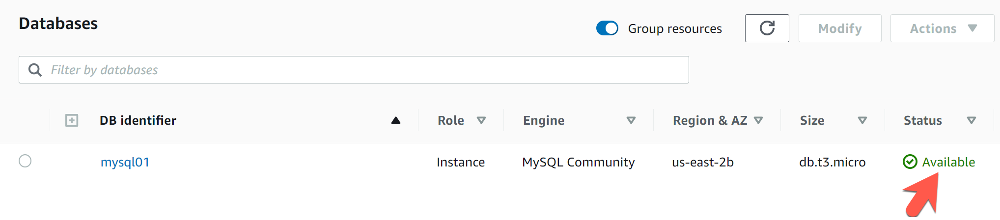
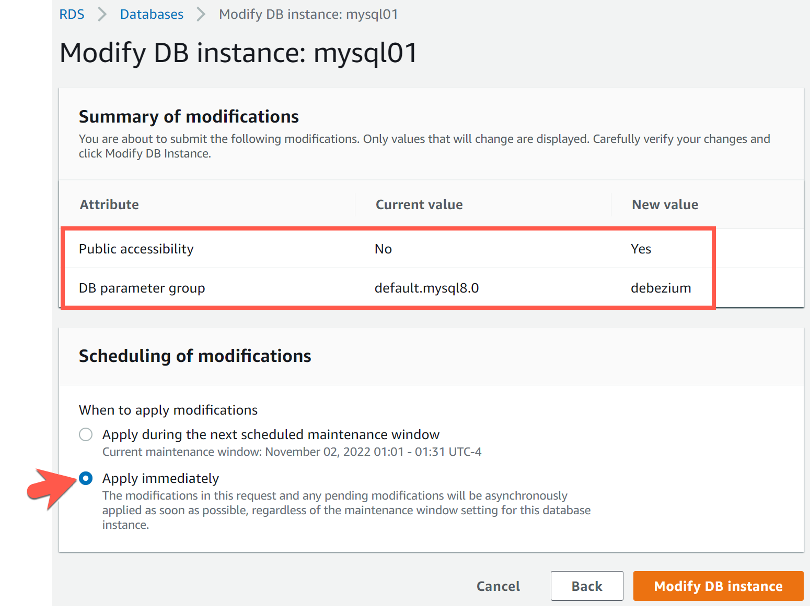

# Setting Up an Amazon RDS MySQL instance to Use with Confluent Cloud MySQL CDC Connector
Robin Moffatt <robin@confluent.io>
v0.02, 25 May 2021

_To follow the Building Data Pipelines with Apache Kafka® and Confluent course exercises, you need a MySQL instance populated with the sample data and accessible from the internet. This short guide shows how to set this up on Amazon RDS_. 

_Specific details may vary. Costs may be incurred and these are your own responsibility._

1. Sign into Amazon Web Services (AWS) and go to RDS. 

2. Create a new MySQL 8.0 database. The lowest spec instance should suffice.
+

** Make a note of the generated password for the master username (which by default is `master`). 
+

3. Whilst waiting for the instance to be available (which can take several minutes) go to **Parameter groups** from the left-hand navigation. Click on **Create parameter group**. 
+
Create a new parameter group for MySQL 8.0. Give it a suitable name. 
+
image::images/dp01-01-07.png[Creating a new parameter group]
+
Now edit the new parameter group and set the following options. Be sure to select **Save changes** once done.
+
[source,bash]
----
binlog_format = ROW
binlog_row_image = full
----
+
image::images/dp01-01-08.png[Parameter group]
+
image::images/dp01-01-09.png[Parameter group]

4. Wait for the instance to be available:
+

+
Click on the database's entry in the list and then click **Modify**:
+

+
Under "Connectivity," expand *Additional configuration* and set the instance as *Publicly accessible*.
+
Under *Additional configuration > Database options > DB parameter group*, set it to the new parameter group that you created above with the modified binlog configuration.
+
In the next screen, set the maintenance to be applied immediately. 
+

5. Make sure that the security group for the instance is open to all inbound connections from the internet. 
+
image::images/dp01-01-15.png[Security group]

6. On the main page for the database, note the endpoint and port. 
+

+
Use a MySQL client to connect to the database. Here's an example using the `mysql` CLI. 
+
[source,bash]
----
$ mysql -u admin -h kafka-data-pipelines.xxxx.rds.amazonaws.com -p
Enter password:
Welcome to the MySQL monitor.  Commands end with ; or \g.
Your MySQL connection id is 21
Server version: 8.0.20 Source distribution

Copyright (c) 2000, 2021, Oracle and/or its affiliates.

Oracle is a registered trademark of Oracle Corporation and/or its
affiliates. Other names may be trademarks of their respective
owners.

Type 'help;' or '\h' for help. Type '\c' to clear the current input statement.

mysql>
----
+
Run this command to check the status of the binlog configuration
+
[source,sql]
----
mysql> show global variables like 'binlog_%';
+------------------+-------+
| Variable_name    | Value |
+------------------+-------+
| binlog_format    | ROW   |
…
| binlog_row_image | FULL  |
+------------------+-------+
1 row in set (0.17 sec)
----
+
Note: If either is not what it should be based on the parameter set, you may need to reboot the database to make it take effect. You can do this from the main RDS page. 
