# Building Data Pipelines with Kafka and Confluent
Robin Moffatt <robin@confluent.io>
v1.10, 21 May 2021

## Module 1 / Exercise 1 - Introduction

In this exercise you will set up the necessary environments for the exercises in the rest of this course. 

### Confluent Cloud

For this course you will use Confluent Cloud to provide a managed Kafka service, connectors, and stream processing. 

1. Go to https://www.confluent.io/confluent-cloud/tryfree?utm_source=learnkafka&NEEDTODOTHERESTOFTHEUTMCODE[Confluent Cloud]. If you don't already have a Confluent Cloud account you can create one here. Use promotion code `<TBC>` for money off your cloud bill.  

2. Create a new cluster in Confluent Cloud. For the purposes of this exercise you can use the `Basic` type. Name the cluster `pipelines_quickstart`. 
+
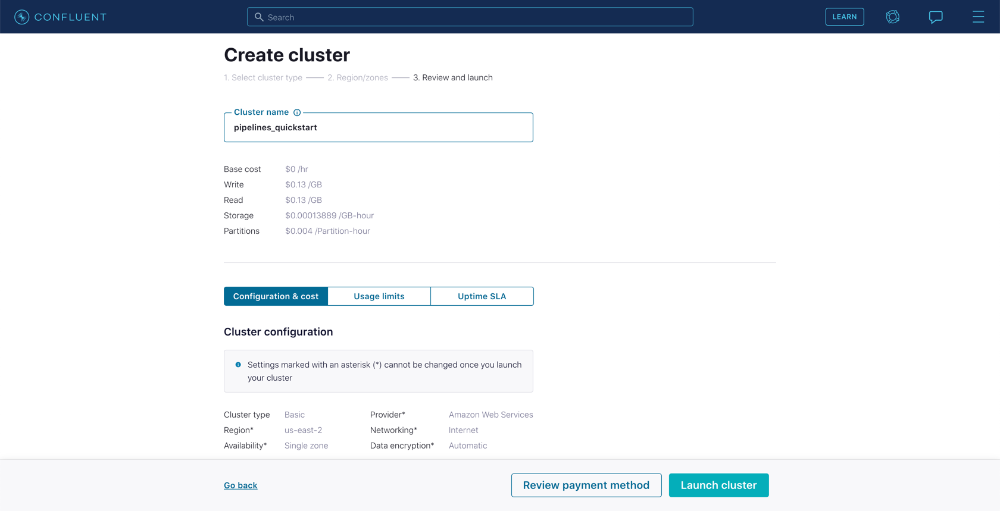

3. Once the cluster is created, you need to make sure that its finished initialising before going to the next step. To do this go to the Topics page and wait for the *Create topic* button to become available
+
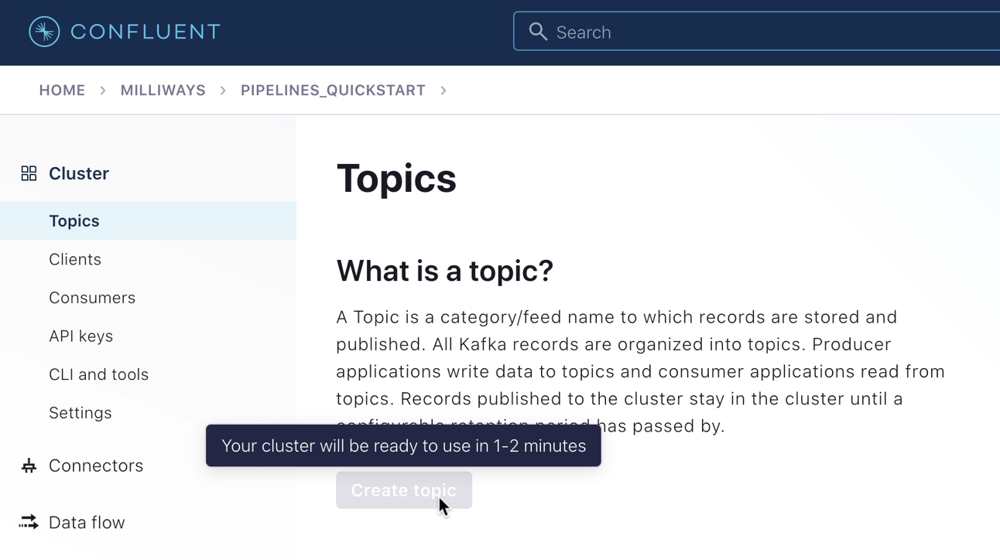
+
image::images/dp01-01-13.png[Create topic available]

4. Next, you need to create a Schema Registry for your environment. 
+
NOTE: If you already have a Schema Registry in your Confluent Cloud environment you can skip this step. 
+
** From the *Schema Registry* option on your environment's home page (or from the left-hand navigation on the Cluster page) click on *Set up on my own*. 
+
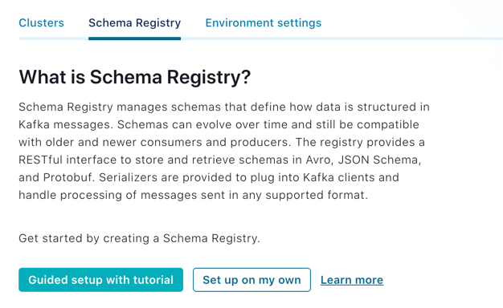
+
** Select a cloud platform and region and click *Continue*
+
image::images/dp02-01-07.png[Creating the Schema Registry]

5. Now go to the ksqlDB page within it and click `Add application`. 
+
If prompted, select *Create application myself*. 
+
Leave the _access control_ set to *Global access*. Give _application name_ as `pipelines-quickstart-ksqldb`, and leave the _number of streaming units_ set to *4*. 
+
image::images/dp01-01-02.png[Creating a ksqlDB application in Confluent Cloud]
+
The ksqlDB application will take a few minutes to provision. 

TODO: `<Disclaimer / warning about costs incurred to go here>`

### Source and Target systems

This course uses a source MySQL database and target Elasticsearch instance. Both of these should be accessible from the internet. 

The provision and configuration of these systems is primarily outside the scope of this exercise. These could be run as managed services (for example, Amazon RDS and Elastic Cloud), or self-hosted and the appropriate networking configured such that they can be connected to from the internet. 

#### MySQL 

You can follow link:aws_rds_mysql.adoc[this guide] to set up an AWS RDS managed MySQL instance. 

Regardless of how you provision your MySQL database, run link:customers.sql[this script] to create the table and data used in this course. If you're using the `mysql` CLI you can do it like this: 

[source,bash]
----
# Note: perhaps this can be done with a curl to pull the `customers.sql` file down
#       from GitHub directly?
mysql -u admin -h $MYSQL_HOST -p < customers.sql
----

#### Elasticsearch

You can run Elasticsearch yourself, or use a managed service such as Elastic Cloud for which you can https://www.elastic.co/cloud/elasticsearch-service/signup[sign up here].

## Module 2 / Exercise 1 - Kafka Connect

In this exercise you will create a new topic to hold ratings event data, and set up a data generator to populate the topic. 

### Create the `ratings` topic

From the *Topics* screen of your Confluent Cloud cluster click on *Add topic*. 

Name the topics `ratings` and ensure that *Number of partitions* is set to `6`. 

image::images/dp02-01-01.png[Creating a new topic]

Click on *Create with defaults*. 

### Create a Data Generator with Kafka Connect

In reality the `ratings` topic would probably be populated from an application using the Producer API to write messages to it. Here we're going to use a data generator that's available as a connector for Kafka Connect. 

1. On Confluent Cloud go to your cluster's *Connectors* page. 
+
In the search box enter `datagen`
+
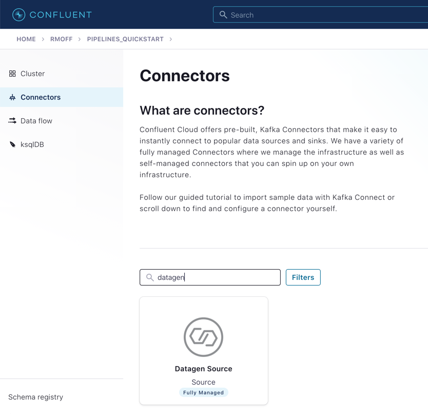
+
Select the *Datagen Source* connector

2. Under *Kafka Cluster credentials* click on *Generate Kafka API key & secret*. 
+
Give a *Description* for the API key, and make a note of the generated key and secret as you'll need these in later exercises
+
image::images/dp02-01-03.png[Kafka API details]

3. Set the remainder of the options as shown below
+
.Datagen configuration options
|===
2+|*Which topic do you want to send data to?*
|Topic name |`ratings` _(as created in the step above)_
2+|*Output messages*
|Output message format | AVRO
2+|*Datagen Details*
|Quickstart | RATINGS
|Max interval between messagse (ms) | 1000
2+|*Number of tasks for this connector*
|Tasks | 1
|===
+
Click *Next*

4. On the confirmation screen the JSON should look like this: 
+
[source,javascript]
----
{
  "name": "DatagenSourceConnector_0",
  "config": {
    "connector.class": "DatagenSource",
    "name": "DatagenSourceConnector_0",
    "kafka.api.key": "****************",
    "kafka.api.secret": "****************************************************************",
    "kafka.topic": "ratings",
    "output.data.format": "AVRO",
    "quickstart": "RATINGS",
    "max.interval": "1000",
    "tasks.max": "1"
  }
}
----
+
If it doesn't, return to the previous screen and amend the values as needed. 
+
Click *Launch* to instantiate the connector. This will take a few moments. 

5. On the *Connectors* page of your cluster you should see the new connector listed, and after a moment or two in status *Running*
+
image::images/dp02-01-04.png[Connector list including datagen]

6. From the *Topics* page of your cluster select the `ratings` topic, and then *Messages*. You should see a steady stream of new messages arriving: 
+
image::images/dp02-01-05.png[New messages arriving on the ratings topic]

## Module 3 / Exercise 1 - Kafka and CDC

In this exercise we'll ingest information about the customers who are writing the rating messages created in the previous exercise. The customer data is held in a MySQL database. 

### View the customer data in MySQL

1. You should have created and populated a MySQL database in the first exercise. If you didn't, please return to that step and complete it before proceeding. 
+
Remember that the MySQL database needs to be accessible from the internet. 

2. Connect to MySQL and check that the customer data is present: 
+
[source,sql]
----
mysql> SELECT first_name, last_name, email, club_status FROM demo.CUSTOMERS LIMIT 5;
+-------------+------------+------------------------+-------------+
| first_name  | last_name  | email                  | club_status |
+-------------+------------+------------------------+-------------+
| Rica        | Blaisdell  | rblaisdell0@rambler.ru | bronze      |
| Ruthie      | Brockherst | rbrockherst1@ow.ly     | platinum    |
| Mariejeanne | Cocci      | mcocci2@techcrunch.com | bronze      |
| Hashim      | Rumke      | hrumke3@sohu.com       | platinum    |
| Hansiain    | Coda       | hcoda4@senate.gov      | platinum    |
+-------------+------------+------------------------+-------------+
5 rows in set (0.24 sec)
----
+
If necessary, return to the first exercise to populate the data into your database. 

### Create a topic for the Customer data

Whilst the MySQL connector can create the target topic for the data that it ingests, we need to create it with certain configuration properties, and therefore will create it explicitly first. This is in general a good practice anyway. 

From the *Topics* screen of your Confluent Cloud cluster click on *Add topic*. 

Name the topics `mysql01.demo.CUSTOMERS` and ensure that *Number of partitions* is set to `6`. 

Click on *Customize settings* and then under *Storage* set the *Cleanup policy* to `Compact`. 

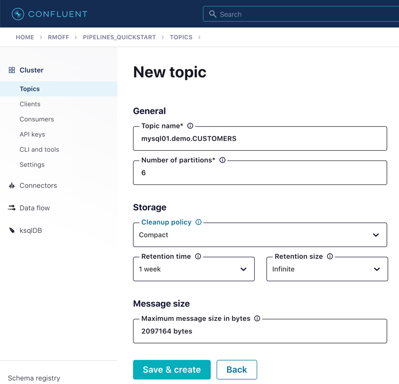

Click on *Save & create*

### Create the MySQL connector

1. From the *Connectors* page in Confluent Cloud click on *Add connector* and search for the `MySQL CDC Source` connector. 
+
image::images/dp03-01-06.png[Searching for the MySQL CDC connector on Confluent Cloud]
+
Click on the connector to add it.
+
NOTE: Make sure you select the `MySQL CDC Source` and _not_ the similarly-named `MySQL Source` connector. 

2. Configure the connector thus:
+
.MySQL CDC Source connector configuration options
|===
2+|*Kafka Cluster credentials*
|Kafka API Key
.2+| _Use the same API details as you created for the Datagen connector above. You can create a new API key if necessary, but API key numbers are limited so for the purposes of this exercise only it's best to re-use if you can._
|Kafka API Secret

2+|*How should we connect to your database?*
|Database hostname
.4+| _These values will depend on where your database is and how you have configured it. The database needs to be open to inbound connections from the internet._
|Database port
|Database username
|Database password
|Database server name|`mysql01`
|SSL mode|`preferred`

2+|*Database details*
|Tables included | `demo.CUSTOMERS`
|Snapshot mode|`when_needed`
2+|*Output messages*
|Output message format | `AVRO`
|After-state only | `true`
2+|*Number of tasks for this connector*
|Tasks | 1
|===

3. Click *Next*. Connectivity to the database will be validated and if successful you'll see a summary screen of configuration. The JSON should look like this: 
+
[source,javascript]
----
{
  "name": "MySqlCdcSourceConnector_0",
  "config": {
    "connector.class": "MySqlCdcSource",
    "name": "MySqlCdcSourceConnector_0",
    "kafka.api.key": "****************",
    "kafka.api.secret": "****************************************************************",
    "database.hostname": "kafka-data-pipelines.xxxxx.rds.amazonaws.com",
    "database.port": "3306",
    "database.user": "admin",
    "database.password": "********************",
    "database.server.name": "mysql01",
    "database.ssl.mode": "preferred",
    "table.include.list": "demo.CUSTOMERS",
    "snapshot.mode": "when_needed",
    "output.data.format": "AVRO",
    "after.state.only": "true",
    "tasks.max": "1"
  }
}
----
+
Click on *Launch*. 

4. After a few moments the connector will be provisioned and shortly thereafter you should see that it is *Running* (alongside the existing `Datagen` connector that you created in the previous exercise): 
+
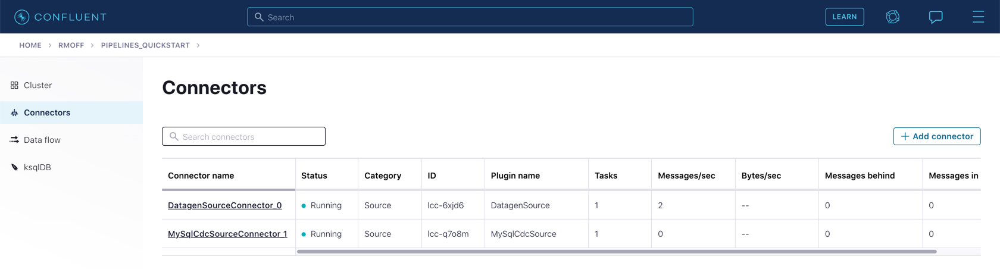

5. From the *Topics* list click on `mysql01.demo.CUSTOMERS` and then *Messages*. Because there is currently only a static set of data in MySQL there is not a stream of new messages arriving on the topic to view. 
+
Click on *offset* and enter 0 and select the first option on the list
+
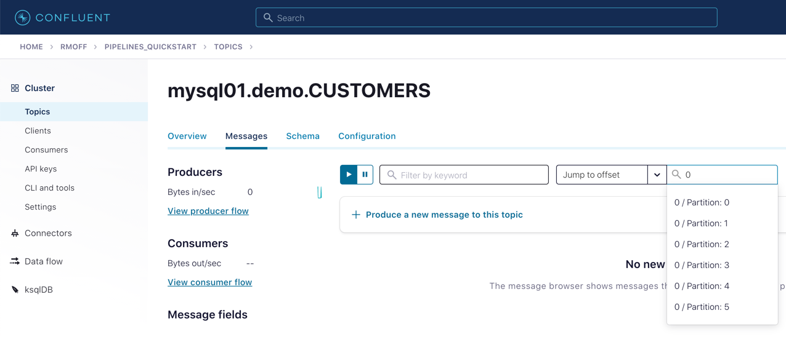
+
You should then see messages present on the topic. 
+
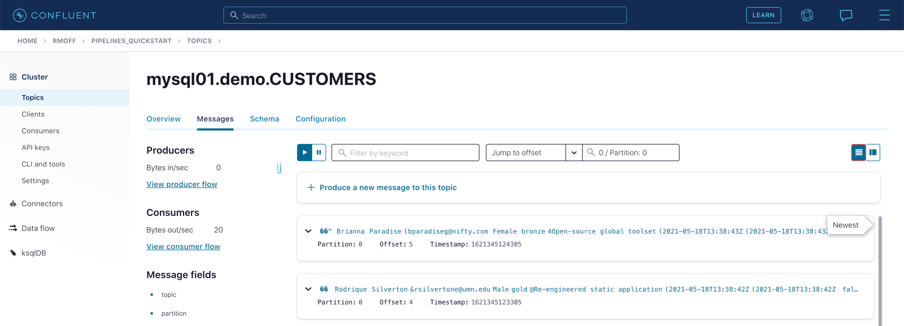

## Module 4 / Exercise 1 - Filtering streams of data

The ratings messages that we receive include a field that indicates the device from which they were left. The field is called `channel` and includes some values indicating that they're from test devices. 

We'd like to create a new stream that includes only data from live devices. For this we can use ksqlDB. 

1. Before continuing, make sure that you have created a ksqlDB application on your Confluent Cloud as described in the first exercise. From the *ksqlDB* page you should see the application listed and in *Status* `Up`.
+
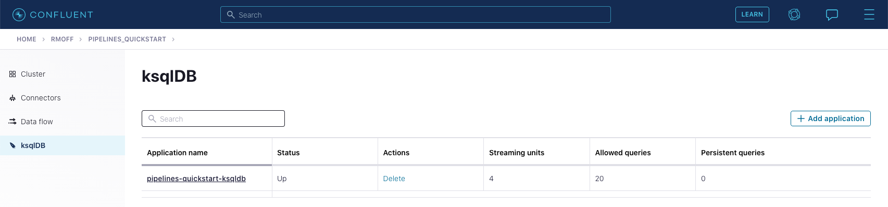

2. Click on the ksqlDB application to open the editor. The first thing you need to do is to declare a ksqlDB stream on the topic with the ratings events in. This gives ksqlDB the information it needs about the schema of the data.
+
Paste the following statement into the *Editor* and click *Run query*
+
[source,sql]
----
CREATE STREAM RATINGS WITH (KAFKA_TOPIC='ratings',VALUE_FORMAT='AVRO');
----
+
image::images/dp04-01-02.png[CREATE STREAM RATINGS]

3. You can view the messages flowing through the Kafka topic by running a `SELECT` against the stream: 
+
[source,sql]
----
SELECT USER_ID, STARS, CHANNEL, MESSAGE FROM RATINGS EMIT CHANGES;
----
+
Use the table icon in to the top right of the messages to view them as columns
+
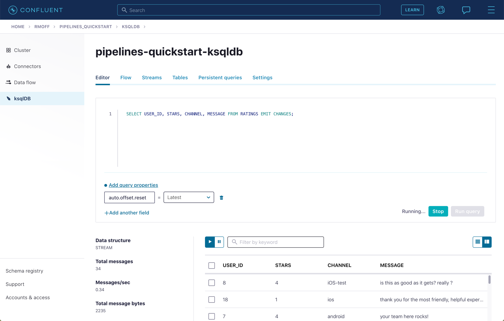

4. Note how in the data shown returned in the above query there are values in the `CHANNEL` field that include `-test`. You can filter these out using a SQL predicate: 
+
[source,sql]
----
SELECT USER_ID, STARS, CHANNEL, MESSAGE 
  FROM RATINGS 
 WHERE LCASE(CHANNEL) NOT LIKE '%test%'
  EMIT CHANGES;
----
+
When you run this you'll notice that the results are returned to the screen. 

5. To tell ksqlDB to process all of the existing messages in the topic as well as all new ones that arrive we set the `auto.offset.reset` parameter to `earliest`. To do this change the dropdown from its default of `Latest` to `Earliest`
+
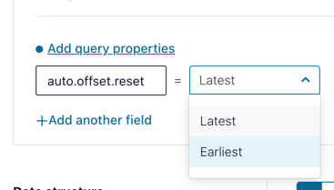

6. Using above statement we can get ksqlDB to write all messages matching this criterion into a new ksqlDB stream. A ksqlDB stream is always backed by a Kafka topic. 
+
[source,sql]
----
CREATE STREAM RATINGS_LIVE AS
SELECT * FROM RATINGS 
 WHERE LCASE(CHANNEL) NOT LIKE '%test%' 
 EMIT CHANGES;
----
+
image::images/dp04-01-05.png[CSAS]

7. Query the new stream and validate that there are no `CHANNEL` values with `test` in them: 
+
[source,sql]
----
SELECT USER_ID, STARS, CHANNEL, MESSAGE 
  FROM RATINGS_LIVE
  EMIT CHANGES;
----
+
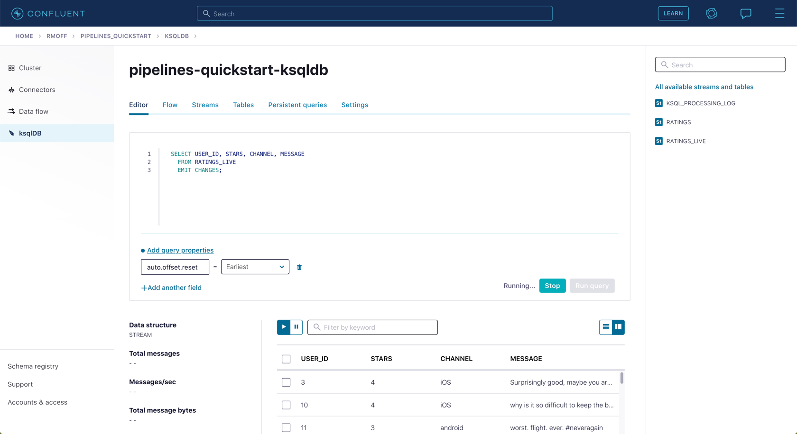

8. From your cluster's *Topics* page locate the new Kafka topic that's been created. It will have a prefix in its name, but end with `RATINGS_LIVE`
+
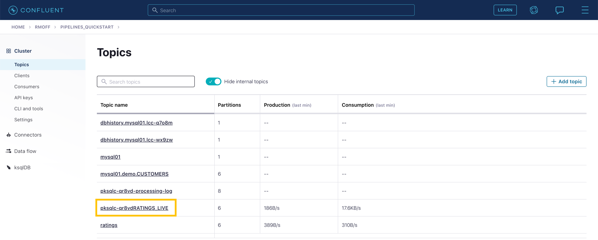
+
Click on the topic. If data lineage is enabled on your cluster click on it to view the flow of data that you've created. 
+
image::images/dp04-01-08.png[Data Lineage]

## Module 5 / Exercise 1 - Enriching events using ksqlDB

In the previous exercise we filtered a stream of ratings events to create a new one that excluded test messages. Now we're going to use the customer information that we are pulling in from an external MySQL database to enrich each rating as it arrives (as well as all the existing ratings that we have already received and are storing on the Kafka topic). 

To do this we need to first model the customer data held in the Kafka topic in such a way that ksqlDB can use it to join to the ratings events. We'll do this by creating a ksqlDB *table* (rather than a *stream* as done for the events). 

1. To start with, we need to pre-process the customer data make the primary key field accessible. Since we need to process all of the data in the topic it's important that we set `auto.offset.reset` to `earliest`. If you don't do this then you'll get no data in the resulting stream. 
+
In the Confluent Cloud ksqlDB editor use the drop-down menu to set `auto.offset.reset` to `earliest` 
+
image::images/dp05-01-01.png[Set offset to earliest]
+
Now run the following SQL
+
[source,sql]
----
CREATE STREAM CUSTOMERS_S 
WITH (KAFKA_TOPIC='mysql01.demo.CUSTOMERS', 
      KEY_FORMAT='JSON', 
      VALUE_FORMAT='AVRO');
----
+
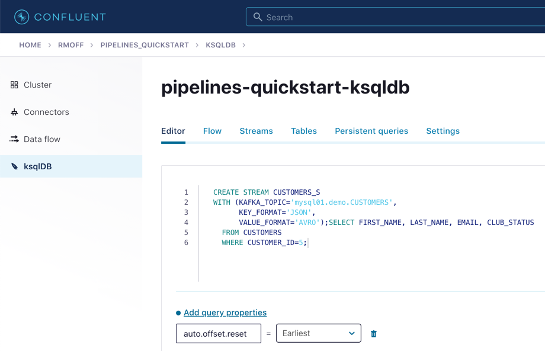

2. Now create a ksqlDB table on the customer data. A ksqlDB table is built on a stream, and returns the value for a given key. If there are two messages with the same key the table will have one entry (rather than two, as in a stream). 
+
Run the following SQL, making sure that as before `auto.offset.reset` is set to `earliest`.
+
[source,sql]
----
CREATE TABLE CUSTOMERS WITH (FORMAT='AVRO') AS
	SELECT id as customer_id,
         latest_by_offset(first_name) as first_name,
         latest_by_offset(last_name) as last_name,
         latest_by_offset(email) as email,
         latest_by_offset(club_status) as club_status
    FROM CUSTOMERS_S
    GROUP BY id;
----

3. With the table created you can now enrich the ratings events with information about the customer, using the primary/foreign key relationship.
+
Run the following SQL to perform a join between the stream of ratings and the table of customer details. Note that the optional `KAFKA_TOPIC` parameter is specified to set the name of the Kafka topic to which the results are written. 
+
[source,sql]
----
CREATE STREAM RATINGS_WITH_CUSTOMER_DATA
       WITH (KAFKA_TOPIC='ratings-enriched')
       AS
SELECT C.CUSTOMER_ID, 
       C.FIRST_NAME + ' ' + C.LAST_NAME AS FULL_NAME,
       C.CLUB_STATUS, 
       C.EMAIL,
       R.RATING_ID, 
       R.MESSAGE, 
       R.STARS, 
       R.CHANNEL,
       TIMESTAMPTOSTRING(R.ROWTIME,'yyyy-MM-dd''T''HH:mm:ss.SSSZ') AS RATING_TS
FROM   RATINGS_LIVE R
       INNER JOIN CUSTOMERS C
         ON R.USER_ID = C.CUSTOMER_ID
EMIT CHANGES;
----

4. Query the newly-created stream: 
+
[source,sql]
----
SELECT * FROM RATINGS_WITH_CUSTOMER_DATA EMIT CHANGES;
----
+
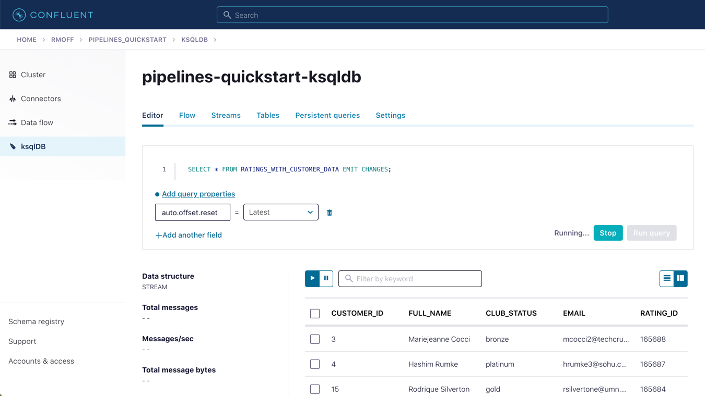

5. To show the power of streaming changes directly from the database we'll make a change to the customer data and observe how it is reflected in the enriched ratings data. 
+
In the Confluent Cloud ksqlDB editor run a query to show current ratings from customer ID 1. Since we only want current ratings set the `auto.offset.reset` to `latest`. Note the value of `CLUB_STATUS` shown for each rating.
+
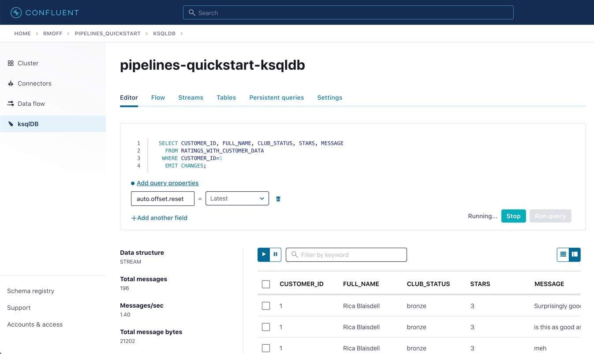
+
Leave the query running in the ksqlDB editor. In *MySQL* make a change to the customer's club status: 
+
[source,sql]
----
UPDATE demo.CUSTOMERS SET CLUB_STATUS='platinum' WHERE ID=1;
----
+
Watch the ksqlDB results table for the next rating from customer ID 1. You should see that it now reflects the updated `CLUB_STATUS`: 
+
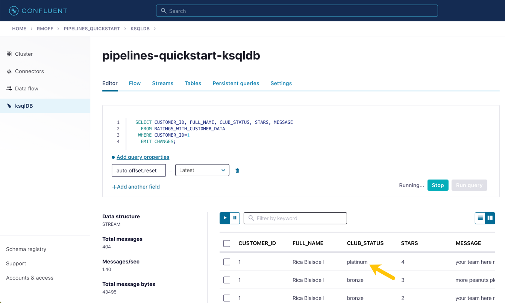

6. If you have data lineage enabled on your Confluent Cloud environment go to the cluster's *Topics* page, click on the `ratings-enriched` topic and then *Data Lineage*. 
+
image::images/dp05-01-07.png[Data Lineage FTW]
+
From here you can see where the data comes from, its relative throughput volumes, and the stages of processing that it goes through.

## Module 6 / Exercise 1 - Streaming data to external systems

This exercise is the culmination of a pipeline project which takes streams of ratings events, filters them and enriches them with information about the customer using data streamed from a database. 

image::images/dp06-01-01.png[Data Lineage]

For the final step we will stream the enriched data out to Elasticsearch from where it can be built into a dashboard. You need to have an Elasticsearch instance created as described in the first exercise, and it must be accessible from the internet. 

1. In Confluent Cloud click on the *Connectors* link, click *Add connector*, and search for the *Elasticsearch Service Sink* connector
+
image::images/dp06-01-02.png[Elasticsearch sink connector in Confluent Cloud]
+
Click on the tile to create the sink connector

2. Configure the connector as follows. You can leave blank any options that are not specified below.
+
.Elasticsearch sink configuration options
|===
2+|*Which topics do you want to get data from?*
|topics |`ratings-enriched`
2+|*Input messages*
|Input message format | AVRO
2+|*Kafka Cluster credentials*
|Kafka API Key
.2+| _Use the same API details as you created for the Datagen connector previously. You can create a new API key if necessary, but API key numbers are limited so for the purposes of this exercise only it's best to re-use if you can._
|Kafka API Secret
2+|*How should we connect to your Elasticsearch Service?*
|Connection URI
.3+| _These values will depend on where your Elasticsearch instance is and how you have configured it. Elasticsearch needs to be open to inbound connections from the internet._
|Connection username
|Connection password
2+|*Data Conversion*
|Type name | `_doc`
|Key ignore | `true`
|Schema ignore | `true`
2+|*Connection Details*
|Batch size | `5` _(this is a setting only suitable for this exercise; in practice you would leave it as the default or set it much higher for performance reasons)._
2+|*Number of tasks for this connector*
|Tasks | 1
|===
+
Click *Next* to test the connection and validate the configuration. 

3. On the next screen the JSON configuration should be similar to that shown below. If it is not, return to the previous screen to amend it as needed.
+
[source,javascript]
----
{
  "name": "ElasticsearchSinkConnector_0",
  "config": {
    "topics": "ratings-enriched",
    "input.data.format": "AVRO",
    "connector.class": "ElasticsearchSink",
    "name": "ElasticsearchSinkConnector_0",
    "kafka.api.key": "****************",
    "kafka.api.secret": "****************************************************************",
    "connection.url": "https://es-host:port",
    "connection.username": "elastic",
    "connection.password": "************************",
    "type.name": "_doc",
    "key.ignore": "true",
    "schema.ignore": "true",
    "batch.size": "5",
    "tasks.max": "1"
  }
}
----
+
Click *Launch* 

4. After a few moments the connector will be provisioned and shortly thereafter you should see that it is *Running* (alongside the existing connectors that you created in previous exercises): 
+
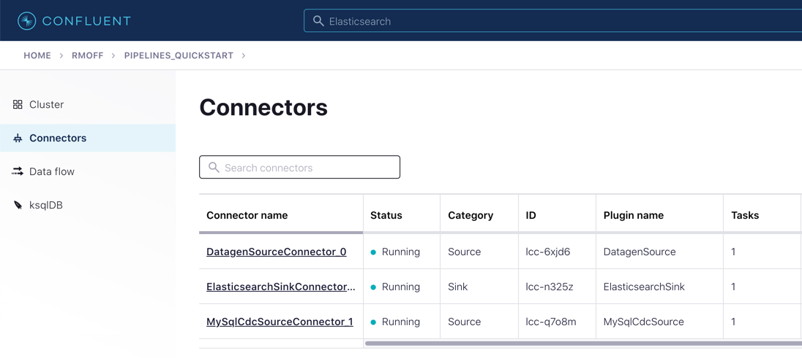

5. In Elasticsearch check that data has been received in the index. You can do this using the REST API or with Kibana itself. Here's an example using `curl` to do it: 
+
[source,bash]
----
curl -u $ES_USER:$ES_PW $ES_ENDPOINT/_cat/indices/ratings\*\?v=true
health status index            uuid                   pri rep docs.count docs.deleted store.size pri.store.size
green  open   ratings-enriched Wj-o_hEwR8ekHSF7M7aVug   1   1     101091            0     12.1mb            6mb
----
+
Note that the `docs.count` value should be above zero. 

6. You can now use the data. In our example we're streaming it to Elasticsearch so as to be able to build an operational dashboard using Kibana. The following assumes that you are familiar with the use of Kibana. 
+
** In Kibana, create an index pattern for the `ratings-enriched` index, with `RATING_TS` as the time field.
+
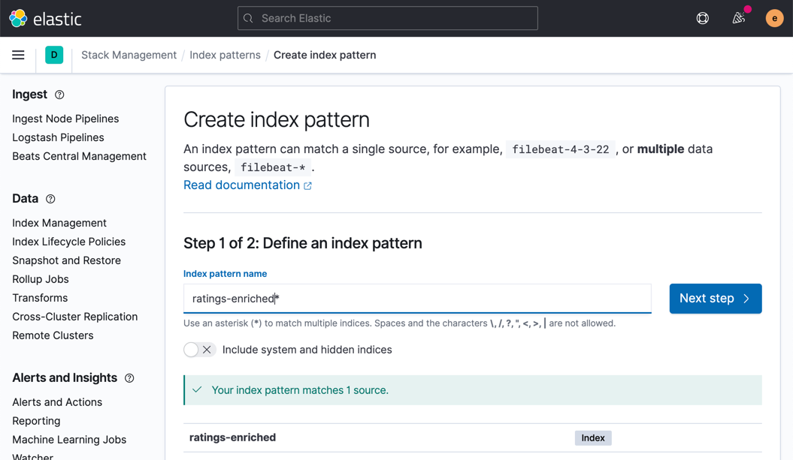
** Use the *Discover* view to explore the data and its characteristics
+
image::images/dp06-01-05.png[Kibana Discover view]
+
Create visualisations to build a dashboard showing relevant details in the data
+
image::images/dp06-01-06.png[Kibana Dashboard]
