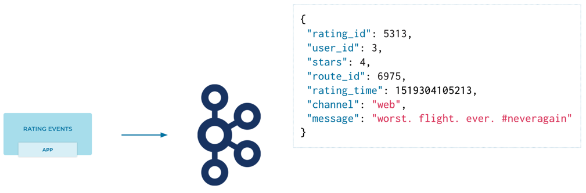
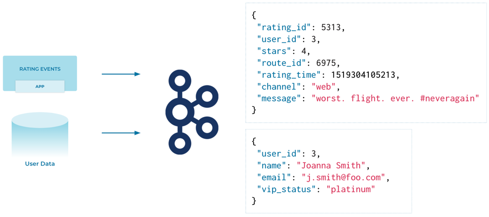
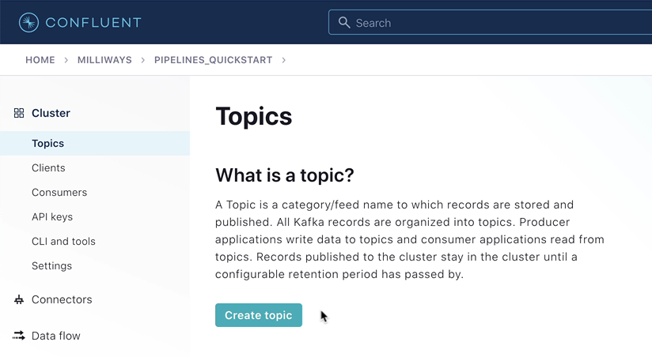

# Module 1 / Exercise 1 - Introduction

In this exercise, you will set up the necessary environments for the exercises in the rest of this course. Before we even do that, let’s talk about *what* we’re even going to be building.

The example streaming data pipeline that we’re going to build during this course is driven by a stream of events arriving with information about product ratings that users submit to our fictional company’s website.

In reality, the ratings would be written from the website to Apache Kafka® using the producer API. For the purposes of our tutorial though, this data is going to come instead from a data generator that we’ll set up in a later step.

Each of the ratings that we receive has a `user_id` field. We can use this to look up information about the user so as to enrich the data that we’ve received and take timely action on it. For example, each user has a name and contact details and is also assigned a VIP status. If we have an important customer leave unhappy reviews, then we probably want to take action so as not to risk them churning. The information about customers is held in a separate system—it’s a fair bet that it’s going to be an RDBMS of some sort. The general pattern to follow with streaming pipelines is to get the data into Kafka and join it to the events there. We’ll get onto why this makes sense later on and talk about exciting things like stream-table duality.

Using stream processing, we can join each event that we’ve already received, and every new one that arrives, to its associated customer data. The resulting enriched information is written back into a Kafka topic and then streamed to the target system where it can be used in an operational dashboard.

## Confluent Cloud

For this course, you will use Confluent Cloud to provide a managed Kafka service, connectors, and stream processing.

1.  Go to [Confluent Cloud](https://www.confluent.io/confluent-cloud/tryfree). If you don’t already have a Confluent Cloud account, you can create one here. Use the promo code `PIPELINES101` for an additional $101 of free usage.

2.  Create a new cluster in Confluent Cloud. For the purposes of this exercise, you can use the `Basic` type. Name the cluster `pipelines_quickstart`.

    

3.  Once the cluster is created, you need to make sure that it has finished initializing before going to the next step. To do this, go to the "Topics" page and wait for the **Create topic** button to become available.

    

    

4.  Next, you need to create a Confluent Schema Registry for your environment.

    If you already have a Schema Registry in your Confluent Cloud environment, you can skip this step.

    -   From the **Schema Registry** option on your environment’s homepage (or from the left-hand navigation on the "Cluster" page), click on **Set up on my own**.

        

    -   Select a cloud platform and region, and click **Continue**.

        

5.  Now go to the ksqlDB page within it and click **Add application**.

    If prompted, select **Create application myself**.

    Leave the *access control* set to "Global access." Make the *application name* 'pipelines-quickstart-ksqldb\`, and leave the *number of streaming units* set to "4."

    

    The ksqlDB application will take a few minutes to provision.

_Make sure that when you have finished the exercises in this course you use the Confluent Cloud UI or CLI to destroy all the resources you created. Verify they are destroyed to avoid unexpected charges._

## Source and Target Systems

This course uses a source MySQL database and target Elasticsearch instance. Both of these should be accessible from the internet.

The provision and configuration of these systems is primarily outside the scope of this exercise. These could be run as managed services (for example, Amazon RDS and Elastic Cloud), or as self-hosted with the appropriate networking configured such that they can be connected to from the internet.

Remember that if you are using a hosted service then there may be recurring costs associated with them. 
### MySQL

You can [follow this guide](aws_rds_mysql.adoc) to set up an Amazon RDS managed MySQL instance.

Regardless of how you provision your MySQL database, [run this script](customers.sql) to create the table and data used in this course. If you’re using the `mysql` CLI, you can do it like this:

    # Note: perhaps this can be done with a curl to pull the `customers.sql` file down
    #       from GitHub directly?
    mysql -u admin -h $MYSQL_HOST -p < customers.sql

### Elasticsearch

You can run Elasticsearch yourself, or [use a managed service such as Elastic Cloud](https://www.elastic.co/cloud/elasticsearch-service/signup).
