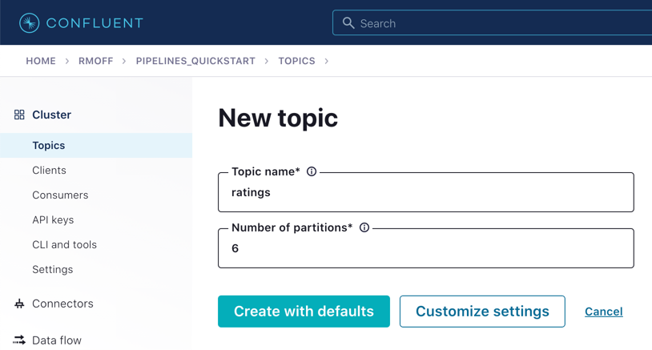
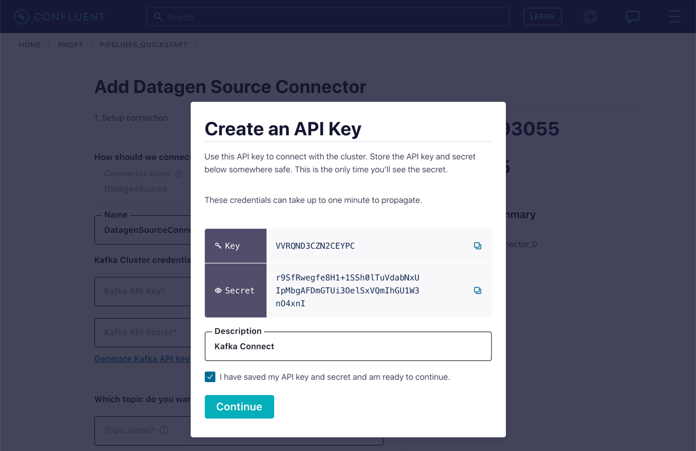
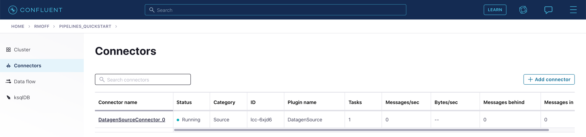

# Module 2 / Exercise 1 - Kafka Connect

In this exercise, you will create a new topic to hold ratings event data, and set up a data generator to populate the topic.

## Create the `ratings` Topic

From the **Topics** page of your Confluent Cloud cluster, click on **Add topic**.

Name the topics `ratings` and ensure that the "Number of partitions" is set to "6."

Click on **Create with defaults**.

## Create a Data Generator with Kafka Connect

In reality, the `ratings` topic would probably be populated from an application using the producer API to write messages to it. Here we’re going to use a data generator that’s available as a connector for Kafka Connect.

1.  On Confluent Cloud, go to your cluster’s **Connectors** page.

    In the search box, enter `datagen`.

    

    Select the **Datagen Source** connector

2.  Under "Kafka Cluster credentials," click on **Generate Kafka API key & secret**.

    Give a "Description" for the API key, and make a note of the generated key and secret as you’ll need these in later exercises.

    

3.  Set the remainder of the options as shown below.

    <table><caption>Datagen configuration options</caption><colgroup><col style="width: 50%" /><col style="width: 50%" /></colgroup><tbody><tr class="odd"><td style="text-align: left;" colspan="2">
<strong>Which topic do you want to send data to?</strong>
</td></tr><tr class="even"><td style="text-align: left;">
Topic name
</td><td style="text-align: left;">
<code>ratings</code> <em>(as created in the step above)</em>
</td></tr><tr class="odd"><td style="text-align: left;" colspan="2">
<strong>Output messages</strong>
</td></tr><tr class="even"><td style="text-align: left;">
Output message format
</td><td style="text-align: left;">
AVRO
</td></tr><tr class="odd"><td style="text-align: left;" colspan="2">
<strong>Datagen Details</strong>
</td></tr><tr class="even"><td style="text-align: left;">
Quickstart
</td><td style="text-align: left;">
RATINGS
</td></tr><tr class="odd"><td style="text-align: left;">
Max interval between messagse (ms)
</td><td style="text-align: left;">
1000
</td></tr><tr class="even"><td style="text-align: left;" colspan="2">
<strong>Number of tasks for this connector</strong>
</td></tr><tr class="odd"><td style="text-align: left;">
Tasks
</td><td style="text-align: left;">
1
</td></tr></tbody></table>

    Datagen configuration options

    Click **Next**

4.  On the confirmation screen, the JSON should look like this:

        {
          "name": "DatagenSourceConnector_0",
          "config": {
            "connector.class": "DatagenSource",
            "name": "DatagenSourceConnector_0",
            "kafka.api.key": "****************",
            "kafka.api.secret": "****************************************************************",
            "kafka.topic": "ratings",
            "output.data.format": "AVRO",
            "quickstart": "RATINGS",
            "max.interval": "1000",
            "tasks.max": "1"
          }
        }

    If it doesn’t, return to the previous screen and amend the values as needed.

    Click **Launch** to instantiate the connector. This will take a few moments.

5.  On the "Connectors" page of your cluster, you should see the new connector listed, and after a moment or two in status **Running**.

    

6.  From the "Topics" page of your cluster, select the `ratings` topic and then **Messages**. You should see a steady stream of new messages arriving:

    

