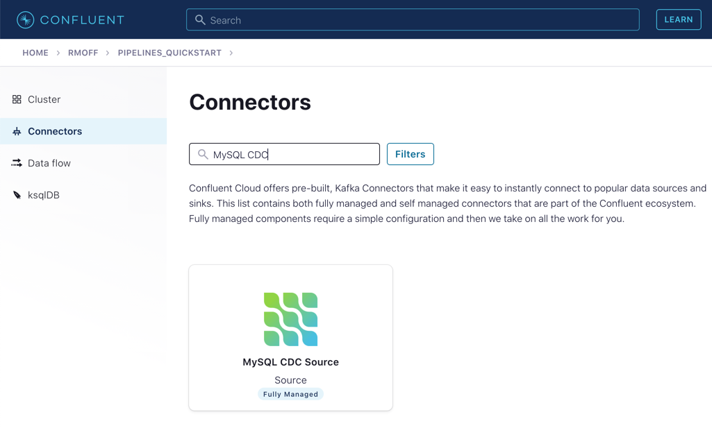

# Module 3 / Exercise 1 - Kafka and Change Data Capture (CDC)

In this exercise, we’ll ingest information about the customers who are writing the rating messages created in the previous exercise. The customer data is held in a MySQL database.

## View Customer Data in MySQL

1.  You should have created and populated a MySQL database in the exercise &lt;TODO: INSERT NAME OF EXERCISE AND ADD ANCHOR LINK&gt;. If you didn’t, please return to that step and complete it before proceeding.

    Remember that the MySQL database needs to be accessible from the internet.

2.  Connect to MySQL and check that the customer data is present:

        mysql> SELECT first_name, last_name, email, club_status FROM demo.CUSTOMERS LIMIT 5;
        +-------------+------------+------------------------+-------------+
        | first_name  | last_name  | email                  | club_status |
        +-------------+------------+------------------------+-------------+
        | Rica        | Blaisdell  | rblaisdell0@rambler.ru | bronze      |
        | Ruthie      | Brockherst | rbrockherst1@ow.ly     | platinum    |
        | Mariejeanne | Cocci      | mcocci2@techcrunch.com | bronze      |
        | Hashim      | Rumke      | hrumke3@sohu.com       | platinum    |
        | Hansiain    | Coda       | hcoda4@senate.gov      | platinum    |
        +-------------+------------+------------------------+-------------+
        5 rows in set (0.24 sec)

    If necessary, return to the first exercise to populate the data into your database.

## Create a Topic for Customer Data

Whilst the MySQL connector can create the target topic for the data that it ingests, we need to create it with certain configuration properties and therefore will create it explicitly first. This is in general a good practice anyway.

From the "Topics" screen of your Confluent Cloud cluster, click on **Add topic**.

Name the topics `mysql01.demo.CUSTOMERS` and ensure that "Number of partitions" is set to "6."

Click on **Customize settings** and then under **Storage** set the **Cleanup policy** to `Compact`.

Click on **Save & create**.

## Create the MySQL connector

1.  From the "Connectors" page in Confluent Cloud, click on **Add connector** and search for the "MySQL CDC Source" connector.

    

    Click on the connector to add it.

    Make sure you select the **MySQL CDC Source** and *not* the similarly named "MySQL Source" connector.

2.  Configure the connector like so:

    <table><caption>MySQL CDC Source connector configuration options</caption><colgroup><col style="width: 50%" /><col style="width: 50%" /></colgroup><tbody><tr class="odd"><td style="text-align: left;" colspan="2">
<strong>Kafka Cluster credentials</strong>
</td></tr><tr class="even"><td style="text-align: left;">
Kafka API Key
</td><td rowspan=2 style="text-align: left;">
<em>Use the same API details as you created for the Datagen connector above. You can create a new API key if necessary, but API key numbers are limited so for the purposes of this exercise only it’s best to re-use if you can.</em>
</td></tr><tr class="odd"><td style="text-align: left;">
Kafka API Secret
</td><td></td></tr><tr class="even"><td style="text-align: left;" colspan="2">
<strong>How should we connect to your database?</strong>
</td></tr><tr class="odd"><td style="text-align: left;">
Database hostname
</td><td rowspan=4 style="text-align: left;">
<em>These values will depend on where your database is and how you have configured it. The database needs to be open to inbound connections from the internet.</em>
</td></tr><tr class="even"><td style="text-align: left;">
Database port
</td><td></td></tr><tr class="odd"><td style="text-align: left;">
Database username
</td><td></td></tr><tr class="even"><td style="text-align: left;">
Database password
</td><td></td></tr><tr class="odd"><td style="text-align: left;">
Database server name
</td><td style="text-align: left;">
<code>mysql01</code>
</td></tr><tr class="even"><td style="text-align: left;">
SSL mode
</td><td style="text-align: left;">
<code>preferred</code>
</td></tr><tr class="odd"><td style="text-align: left;" colspan="2">
<strong>Database details</strong>
</td></tr><tr class="even"><td style="text-align: left;">
Tables included
</td><td style="text-align: left;">
<code>demo.CUSTOMERS</code>
</td></tr><tr class="odd"><td style="text-align: left;">
Snapshot mode
</td><td style="text-align: left;">
<code>when_needed</code>
</td></tr><tr class="even"><td style="text-align: left;" colspan="2">
<strong>Output messages</strong>
</td></tr><tr class="odd"><td style="text-align: left;">
Output message format
</td><td style="text-align: left;">
<code>AVRO</code>
</td></tr><tr class="even"><td style="text-align: left;">
After-state only
</td><td style="text-align: left;">
<code>true</code>
</td></tr><tr class="odd"><td style="text-align: left;" colspan="2">
<strong>Number of tasks for this connector</strong>
</td></tr><tr class="even"><td style="text-align: left;">
Tasks
</td><td style="text-align: left;">
1
</td></tr></tbody></table>

    MySQL CDC Source connector configuration options

3.  Click **Next**. Connectivity to the database will be validated and if successful you’ll see a summary screen of configuration. The JSON should look like this:

        {
          "name": "MySqlCdcSourceConnector_0",
          "config": {
            "connector.class": "MySqlCdcSource",
            "name": "MySqlCdcSourceConnector_0",
            "kafka.api.key": "****************",
            "kafka.api.secret": "****************************************************************",
            "database.hostname": "kafka-data-pipelines.xxxxx.rds.amazonaws.com",
            "database.port": "3306",
            "database.user": "admin",
            "database.password": "********************",
            "database.server.name": "mysql01",
            "database.ssl.mode": "preferred",
            "table.include.list": "demo.CUSTOMERS",
            "snapshot.mode": "when_needed",
            "output.data.format": "AVRO",
            "after.state.only": "true",
            "tasks.max": "1"
          }
        }

    Click on **Launch**.

4.  After a few moments, the connector will be provisioned and shortly thereafter you should see that it is "Running" (alongside the existing Datagen connector that you created in the previous exercise):

    

5.  From the "Topics" list, click on `mysql01.demo.CUSTOMERS` and then **Messages**. Because there is currently only a static set of data in MySQL, there is not a stream of new messages arriving on the topic to view.

    Click on **offset**, enter "0," and select the first option on the list. 
    
    

    You should then see messages present on the topic.

    

