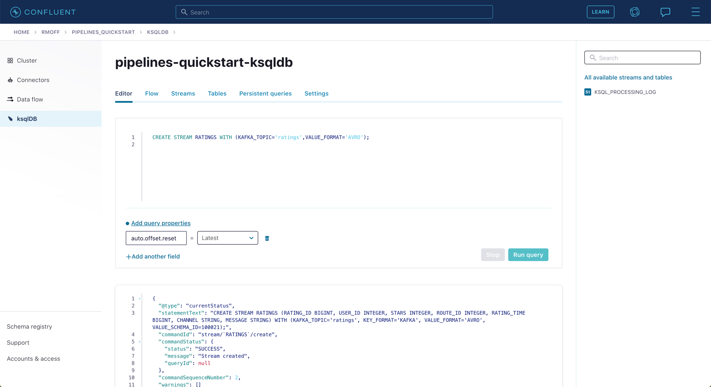
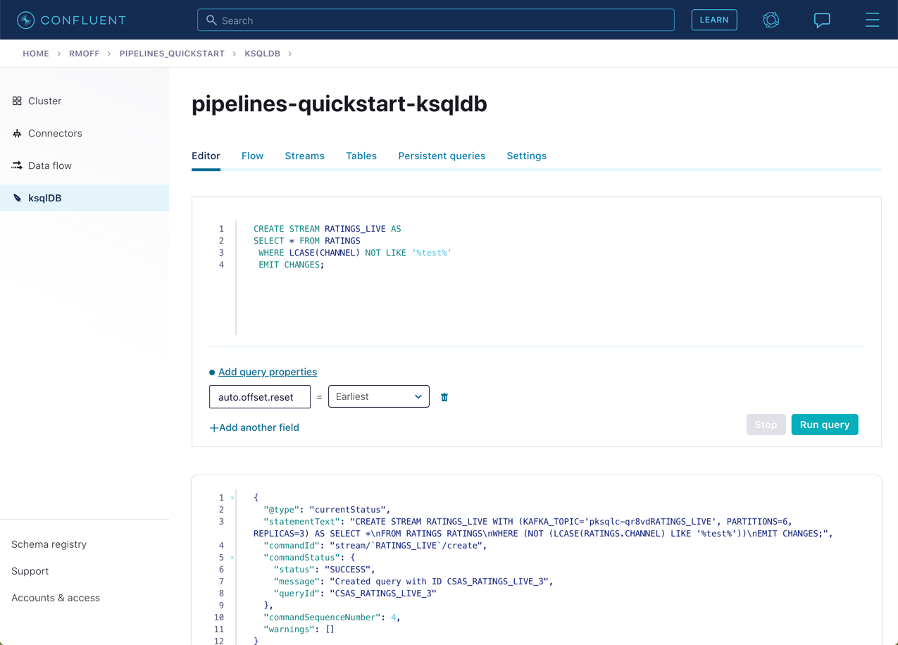
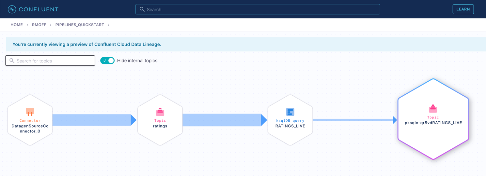

# Module 4 / Exercise 1 - Filtering Streams of Data

The ratings messages that we receive include a field that indicates the device from which they were left. The field is called `channel` and includes some values indicating that they’re from test devices.

We’d like to create a new stream that includes only data from live devices. For this we can use ksqlDB.

1.  Before continuing, make sure that you have created a ksqlDB application on Confluent Cloud as described in the first exercise &lt;INSERT NAME OF EXERCISE AND ADD ANCHOR LINK&gt;. From the "ksqlDB" page, you should see the application listed and in "Status" `Up`.

    

2.  Click on the ksqlDB application to open the editor. The first thing that you need to do is to declare a ksqlDB stream on the topic with the ratings events in. This gives ksqlDB the information that it needs about the schema of the data.

    Paste the following statement into the "Editor" and click **Run query**.

        CREATE STREAM RATINGS WITH (KAFKA_TOPIC='ratings',VALUE_FORMAT='AVRO');

    

3.  You can view the messages flowing through the Kafka topic by running a `SELECT` against the stream:

        SELECT USER_ID, STARS, CHANNEL, MESSAGE FROM RATINGS EMIT CHANGES;

    Use the table icon in to the top right of the messages to view them as columns

    

4.  Note how in the data shown returned in the above query, there are values in the `CHANNEL` field that include `-test`. You can filter these out using a SQL predicate:

        SELECT USER_ID, STARS, CHANNEL, MESSAGE
          FROM RATINGS
         WHERE LCASE(CHANNEL) NOT LIKE '%test%'
          EMIT CHANGES;

    When you run this, you’ll notice that the results are returned to the screen.

5.  To tell ksqlDB to process all of the existing messages in the topic as well as all new ones that arrive, we set the `auto.offset.reset` parameter to `earliest`. To do this, change the dropdown from its default of `Latest` to `Earliest`.

    

6.  Using the above statement, we can get ksqlDB to write all messages matching this criterion into a new ksqlDB stream. A ksqlDB stream is always backed by a Kafka topic.

        CREATE STREAM RATINGS_LIVE AS
        SELECT * FROM RATINGS
         WHERE LCASE(CHANNEL) NOT LIKE '%test%'
         EMIT CHANGES;

    

7.  Query the new stream and validate that there are no `CHANNEL` values with `test` in them:

        SELECT USER_ID, STARS, CHANNEL, MESSAGE
          FROM RATINGS_LIVE
          EMIT CHANGES;

    

8.  From your cluster’s "Topics" page, locate the new Kafka topic that’s been created. It will have a prefix in its name but end with `RATINGS_LIVE`.

    

    Click on the topic. If data lineage is enabled on your cluster, click on it to view the flow of data that you’ve created.

    

TODO: `<Disclaimer / warning about costs incurred to go here>`

