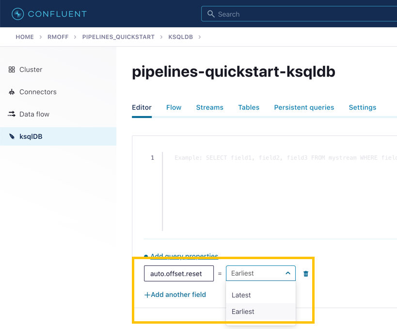

# Module 5 / Exercise 1 - Enriching Events Using ksqlDB

In the previous exercise, we filtered a stream of ratings events to create a new one that excluded test messages. Now we’re going to use the customer information that we are pulling in from an external MySQL database to enrich each rating as it arrives (as well as all the existing ratings that we have already received and are storing on the Kafka topic).

To do this, we need to first model the customer data held in the Kafka topic in such a way that ksqlDB can use it to join to the ratings events. We’ll do this by creating a ksqlDB *table* (rather than a *stream* as done for the events).

1.  To start with, we need to pre-process the customer data to make the primary key field accessible. Because we need to process all of the data in the topic, it’s important that we set `auto.offset.reset` to `earliest`. If you don’t do this, then you’ll get no data in the resulting stream.

    In the Confluent Cloud ksqlDB editor, use the drop-down menu to set `auto.offset.reset` to `earliest`.

    

    Now run the following SQL:

        CREATE STREAM CUSTOMERS_S
        WITH (KAFKA_TOPIC='mysql01.demo.CUSTOMERS',
              KEY_FORMAT='JSON',
              VALUE_FORMAT='AVRO');

    

2.  Now create a ksqlDB table on the customer data. A ksqlDB table is built on a stream and returns the value for a given key. If there are two messages with the same key, the table will have one entry (rather than two, as in a stream).

    Run the following SQL, making sure that as before, `auto.offset.reset` is set to `earliest`.

        CREATE TABLE CUSTOMERS WITH (FORMAT='AVRO') AS
            SELECT id as customer_id,
                 latest_by_offset(first_name) as first_name,
                 latest_by_offset(last_name) as last_name,
                 latest_by_offset(email) as email,
                 latest_by_offset(club_status) as club_status
            FROM CUSTOMERS_S
            GROUP BY id;

3.  With the table created, you can now enrich the ratings events with information about the customer, using the primary/foreign key relationship.

    Run the following SQL to perform a join between the stream of ratings and the table of customer details. Note that the optional `KAFKA_TOPIC` parameter is specified to set the name of the Kafka topic to which the results are written.

        CREATE STREAM RATINGS_WITH_CUSTOMER_DATA
               WITH (KAFKA_TOPIC='ratings-enriched')
               AS
        SELECT C.CUSTOMER_ID,
               C.FIRST_NAME + ' ' + C.LAST_NAME AS FULL_NAME,
               C.CLUB_STATUS,
               C.EMAIL,
               R.RATING_ID,
               R.MESSAGE,
               R.STARS,
               R.CHANNEL,
               TIMESTAMPTOSTRING(R.ROWTIME,'yyyy-MM-dd''T''HH:mm:ss.SSSZ') AS RATING_TS
        FROM   RATINGS_LIVE R
               INNER JOIN CUSTOMERS C
                 ON R.USER_ID = C.CUSTOMER_ID
        EMIT CHANGES;

4.  Query the newly created stream:

        SELECT * FROM RATINGS_WITH_CUSTOMER_DATA EMIT CHANGES;

    

5.  To show the power of streaming changes directly from the database, we’ll make a change to the customer data and observe how it is reflected in the enriched ratings data.

    In the Confluent Cloud ksqlDB editor, run a query to show current ratings from customer ID 1. Because we only want current ratings, set the `auto.offset.reset` to `latest`. Note the value of `CLUB_STATUS` shown for each rating.

    

    Leave the query running in the ksqlDB editor. In MySQL, make a change to the customer’s club status:

        UPDATE demo.CUSTOMERS SET CLUB_STATUS='platinum' WHERE ID=1;

    Watch the ksqlDB results table for subsequent ratings from customer ID 1. You should see that it soon reflects the updated `CLUB_STATUS`:

        SELECT CUSTOMER_ID, FULL_NAME, CLUB_STATUS, STARS, MESSAGE
          FROM RATINGS_WITH_CUSTOMER_DATA
         WHERE CUSTOMER_ID=1
          EMIT CHANGES;

    

6.  If you have data lineage enabled on your Confluent Cloud environment, go to the cluster’s "Topics" page, click on the `ratings-enriched` topic and then **Data Lineage**.

    

    From here, you can see where the data comes from, its relative throughput volumes, and the stages of processing that it goes through.

