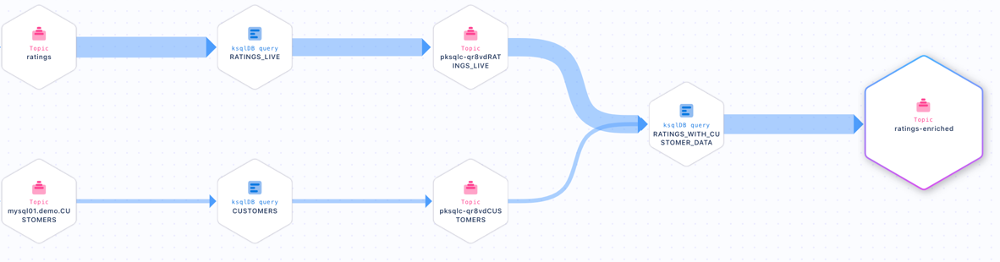
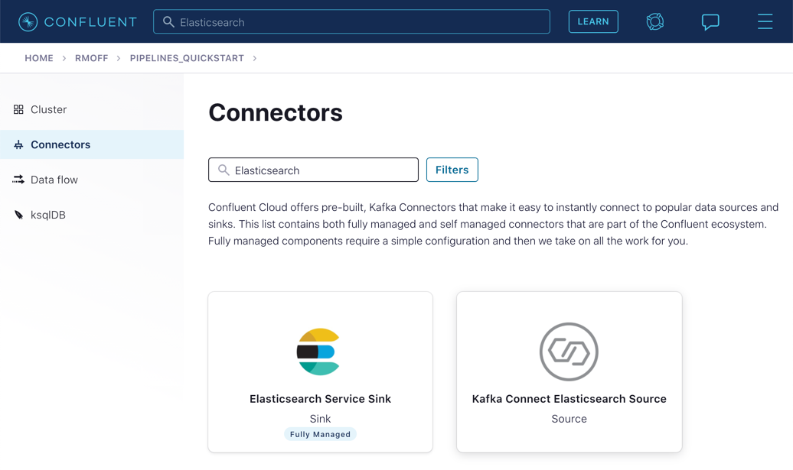
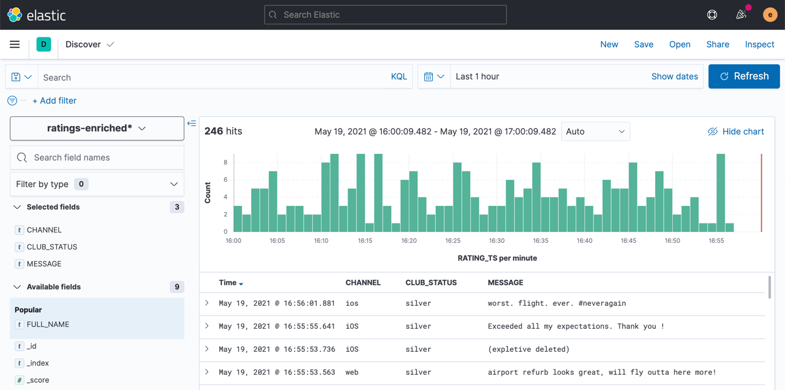
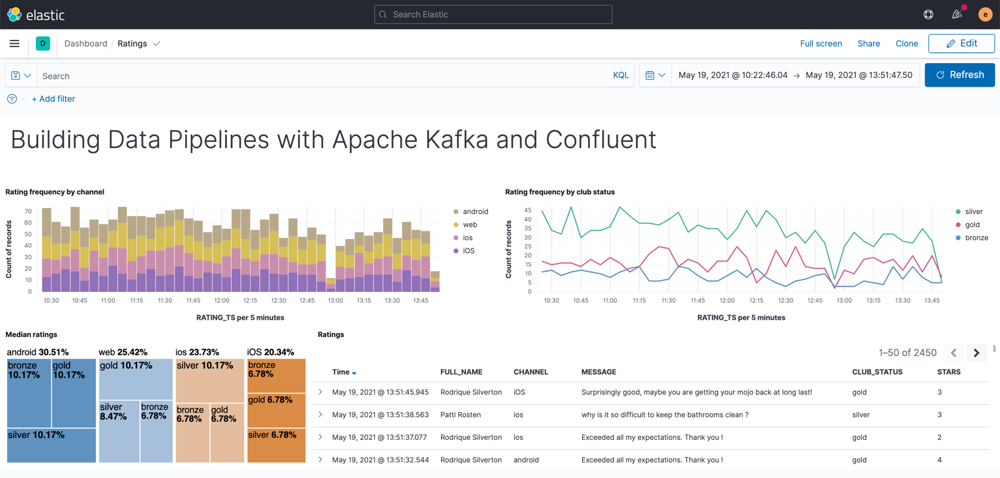

# Module 6 / Exercise 1 - Streaming Data to External Systems

This exercise is the culmination of a pipeline project that takes streams of ratings events, filters them, and enriches them with information about the customer using data streamed from a database.

For the final step, we will stream the enriched data out to Elasticsearch from where it can be built into a dashboard. You need to have an Elasticsearch instance created as described in the first exercise &lt;TODO: INSERT NAME OF EXERCISE AND ADD ANCHOR LINK&gt;, and it must be accessible from the internet.

1.  In Confluent Cloud, click on the **Connectors** link, click **Add connector**, and search for the "Elasticsearch Service Sink" connector.

    

    Click on the tile to create the sink connector.

2.  Configure the connector as follows. You can leave blank any options that are not specified below.

    <table><caption>Elasticsearch sink configuration options</caption><colgroup><col style="width: 50%" /><col style="width: 50%" /></colgroup><tbody><tr class="odd"><td style="text-align: left;" colspan="2">
<strong>Which topics do you want to get data from?</strong>
</td></tr><tr class="even"><td style="text-align: left;">
topics
</td><td style="text-align: left;">
<code>ratings-enriched</code>
</td></tr><tr class="odd"><td style="text-align: left;" colspan="2">
<strong>Input messages</strong>
</td></tr><tr class="even"><td style="text-align: left;">
Input message format
</td><td style="text-align: left;">
AVRO
</td></tr><tr class="odd"><td style="text-align: left;" colspan="2">
<strong>Kafka Cluster credentials</strong>
</td></tr><tr class="even"><td style="text-align: left;">
Kafka API Key
</td><td style="text-align: left;">
<em>Use the same API details as you created for the Datagen connector previously. You can create a new API key if necessary, but API key numbers are limited so for the purposes of this exercise only it’s best to re-use if you can.</em>
</td></tr><tr class="odd"><td style="text-align: left;">
Kafka API Secret
</td><td></td></tr><tr class="even"><td style="text-align: left;" colspan="2">
<strong>How should we connect to your Elasticsearch Service?</strong>
</td></tr><tr class="odd"><td style="text-align: left;">
Connection URI
</td><td style="text-align: left;">
<em>These values will depend on where your Elasticsearch instance is and how you have configured it. Elasticsearch needs to be open to inbound connections from the internet.</em>
</td></tr><tr class="even"><td style="text-align: left;">
Connection username
</td><td></td></tr><tr class="odd"><td style="text-align: left;">
Connection password
</td><td></td></tr><tr class="even"><td style="text-align: left;" colspan="2">
<strong>Data Conversion</strong>
</td></tr><tr class="odd"><td style="text-align: left;">
Type name
</td><td style="text-align: left;">
<code>_doc</code>
</td></tr><tr class="even"><td style="text-align: left;">
Key ignore
</td><td style="text-align: left;">
<code>true</code>
</td></tr><tr class="odd"><td style="text-align: left;">
Schema ignore
</td><td style="text-align: left;">
<code>true</code>
</td></tr><tr class="even"><td style="text-align: left;" colspan="2">
<strong>Connection Details</strong>
</td></tr><tr class="odd"><td style="text-align: left;">
Batch size
</td><td style="text-align: left;">
<code>5</code> <em>(this is a setting only suitable for this exercise; in practice you would leave it as the default or set it much higher for performance reasons).</em>
</td></tr><tr class="even"><td style="text-align: left;" colspan="2">
<strong>Number of tasks for this connector</strong>
</td></tr><tr class="odd"><td style="text-align: left;">
Tasks
</td><td style="text-align: left;">
1
</td></tr></tbody></table>

    Elasticsearch sink configuration options

    Click **Next** to test the connection and validate the configuration.

3.  On the next screen, the JSON configuration should be similar to that shown below. If it is not, return to the previous screen to amend it as needed.

        {
          "name": "ElasticsearchSinkConnector_0",
          "config": {
            "topics": "ratings-enriched",
            "input.data.format": "AVRO",
            "connector.class": "ElasticsearchSink",
            "name": "ElasticsearchSinkConnector_0",
            "kafka.api.key": "****************",
            "kafka.api.secret": "****************************************************************",
            "connection.url": "https://es-host:port",
            "connection.username": "elastic",
            "connection.password": "************************",
            "type.name": "_doc",
            "key.ignore": "true",
            "schema.ignore": "true",
            "batch.size": "5",
            "tasks.max": "1"
          }
        }

    Click **Launch**.

4.  After a few moments, the connector will be provisioned and shortly thereafter you should see that it is "Running" (alongside the existing connectors that you created in previous exercises):

    

5.  In Elasticsearch, check that data has been received in the index. You can do this using the REST API or with Kibana itself. Here’s an example using `curl` to do it:

        curl -u $ES_USER:$ES_PW $ES_ENDPOINT/_cat/indices/ratings\*\?v=true
        health status index            uuid                   pri rep docs.count docs.deleted store.size pri.store.size
        green  open   ratings-enriched Wj-o_hEwR8ekHSF7M7aVug   1   1     101091            0     12.1mb            6mb

    Note that the `docs.count` value should be above zero.

6.  You can now use the data. In our example, we’re streaming it to Elasticsearch so as to be able to build an operational dashboard using Kibana. The following assumes that you are familiar with the use of Kibana.

    -   In Kibana, create an index pattern for the `ratings-enriched` index, with `RATING_TS` as the time field.

        

    -   Use the **Discover** view to explore the data and its characteristics

        

        Create visualizations to build a dashboard showing relevant details in the data.

        

_Make sure that when you have finished the exercises in this course you use the Confluent Cloud UI or CLI to destroy all the resources you created. Verify they are destroyed to avoid unexpected charges._
