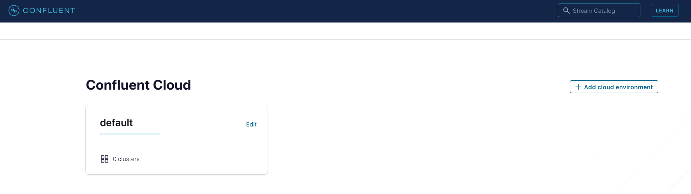
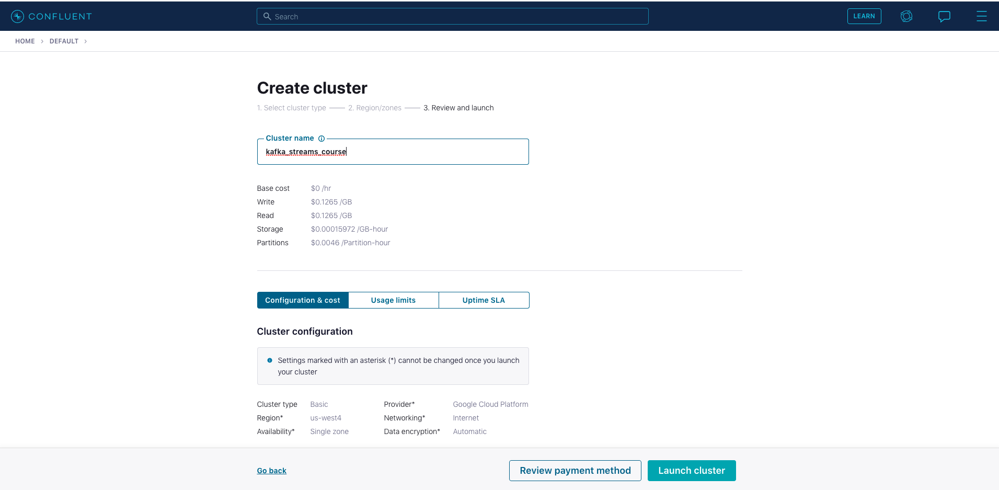
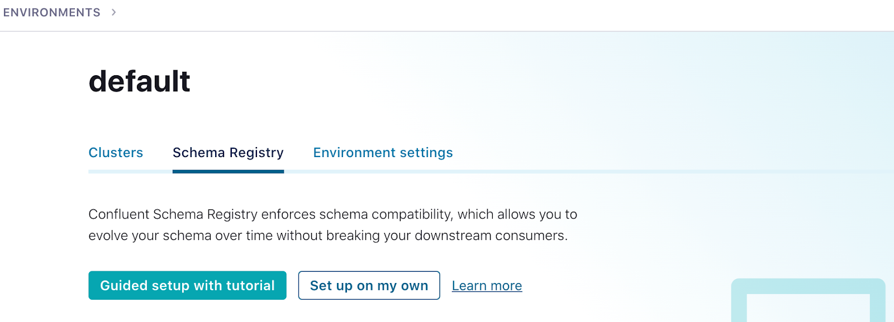
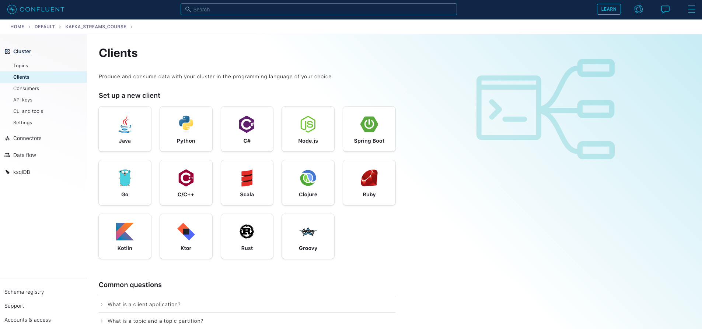
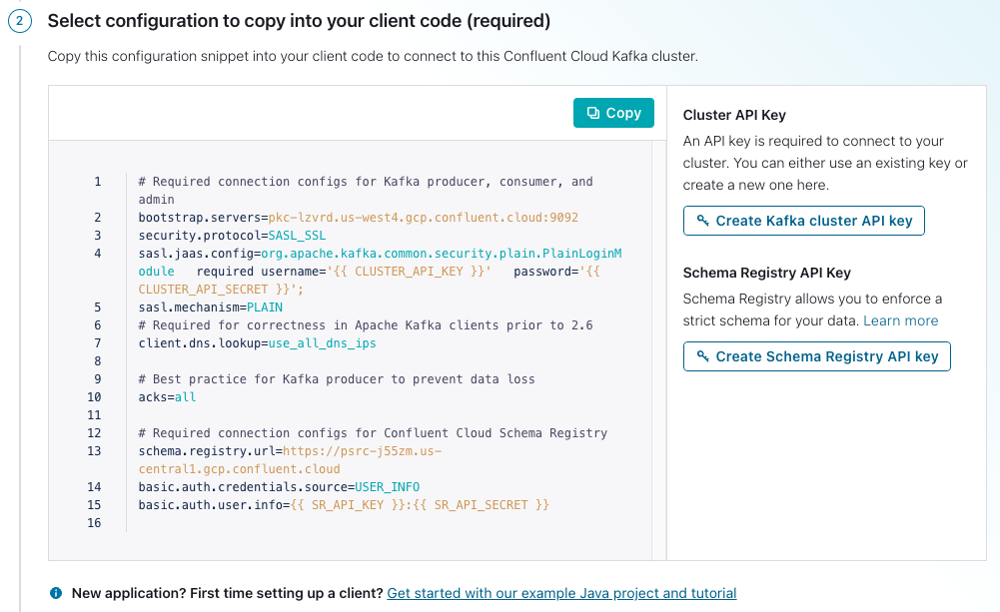

# Kafka Streams Course

This is the code repo containing the full solutions to the exercises
for the Kafka Streams course.  To get started you'll need to sign up
for a CCloud account.  Follow the steps below to get everything ready to go.

It's recommended that you do these exercises while following along with the [Kafka Streams 101 course](https://developer.confluent.io/learn-kafka/kafka-streams/get-started/).
The link for each module of the course related to the exercise description will be provided.

##  Confluent Cloud
 
1. Go to [Confluent Cloud](https://www.confluent.io/confluent-cloud/tryfree?utm_source=learnkafka). 
   If you don’t already have a Confluent Cloud account you can create one here. Use promotion code <TBC> for money off your cloud bill.
2. Once logged into your cloud account click on the `Add cloud environment button` on the right-hand side of the screen.  Name the environment something like "kafka_streams_course_env".  You can also choose to use the `default` environment already present.  Using a new environment gives you the ability to keep resources separate on your Confluent account.
   
3. Click on the environment you just created or the `default` environment tile. Create a new cluster in Confluent by clicking on`Create cluster on my own`.  For the purposes of all the exercise modules you can use the `Basic` type. 
   Name the cluster `kafka_streams_course`. Then click on the `Launch Cluster` button on the bottom right.
   
4. You’ll also need to set up a Schema Registry. Click on the environment link in the upper left corner, either `default` or the name of the environment you created. 
   Then click the Schema Registry tab and follow the prompts to set up a schema registry on the provider of your choice. Once that is complete, go back to your cluster.
   
5. Next click on `Data Integration` in the menu on the left, then select `Clients`, then the `Java` tile.
     
   
6. After step three above, you'll go to a page where you can create credentials for your cluster and Schema Registry.                               
   

   1. Click on `Create Kafka cluster API key`.
   2. Copy your key and secret, name the file, then click `Download and continue`. (Your credentials will populate into the configurations boilerplate.)
   3. Click on `Create Schema Registry API key`.
   4. Copy your key and secret, name the file, then click `Download and continue`. (Your credentials will populate into the configurations boilerplate.)
   5. Make sure `Show API keys` is selected, then `Copy` the configurations in the window.
   6. Create a file named `ccloud.properties` in the `src/main/resources directory` of the cloned repo. Then paste the configurations into a file named `ccloud.properties`. Note that this file is ignored and should never get checked into GitHub.
       
Here's what you `ccloud.properties` file should look like except the values inside the `{{ }}` braces will have the 
required credentials
```text
# Required connection configs for Kafka producer, consumer, and admin
bootstrap.servers={{ BOOTSTRAP_SERVERS }}
security.protocol=SASL_SSL
sasl.jaas.config=org.apache.kafka.common.security.plain.PlainLoginModule   required username='{{ CLUSTER_API_KEY }}'   password='{{ CLUSTER_API_SECRET }}';
sasl.mechanism=PLAIN
# Required for correctness in Apache Kafka clients prior to 2.6
client.dns.lookup=use_all_dns_ips

# Best practice for Kafka producer to prevent data loss
acks=all

# Required connection configs for Confluent Cloud Schema Registry
schema.registry.url={{ SR_URL }}
basic.auth.credentials.source=USER_INFO
basic.auth.user.info={{ SR_API_KEY }}:{{ SR_API_SECRET }}
```

## Setting up properties for running the exercise code
Now we're going to set up properties for the various exercises.  You are taking a couple of minor extra steps to make sure
that any sensitive information doesn't get accidentally checked into GitHub.  Run the following commands:

1. cd into the `src/main/resources` directory
2. cat `streams.properties.orig` > `streams.properties`
3. cat `ccloud.properties` >> `streams.properties`

## Running the exercises

The first step before working with any of streams exercises will be to run `./gradlew build` to make generate all of the
Avro objects from the schemas contained in the `/src/main/avro` directory.

The exercises are self-contained and can be run independently of any other exercise.  To increase the visibility of the running code
logging for the exercise will get output to `logs/kafka_streams_course.log`.  The `log4j2.properties` file is set to 
**_not append_** so each run of an exercise will wipe out the logs for a previous run.

Each streams application will print the records coming into the topology, and the records going out of the topology. Also, 
some streams applications will print to the console from different handlers.  To that end, you should let each application run
for at least 40 seconds, as some of them don't have immediate output.

Every application uses utility class,
`TopologyLoader`, which will create the required topics and populate them with some sample data.

Finally, to run an exercise from the command line (assuming you are in the root directory of the repo) run the following 
command:

`./gradlew runStreams -Pargs=<application>`

where `<application>` is one of `aggregate, basic, errors, joins, ktable, processor, time, windows`

Each execution of `runStreams` will build the project first.  Each streams application will continue to run after you have started it, so once you are done
enter a `CTRL+C` from the keyboard to shut it down.

### Exercise Descriptions

Here's a brief description of each example in this repository.  For detailed step-by-step descriptions follow the Kafka Streams
course videos.  Note that for the purposes of facilitating the learning process, each exercise uses a utility class `TopicLoader` that will create
the required topics and populate them with some sample records for the Kafka Streams application. As a result when you run each exercise, the first output you'll 
see on the console is from the `Callback` interface, and it will look similar to this:
```text
Record produced - offset - 0 timestamp - 1622133855705 
Record produced - offset - 1 timestamp - 1622133855717 
Record produced - offset - 2 timestamp - 1622133855717 
```
Each exercise is incomplete, and it's up to you to follow the instructions and hints in the comments to get each application into running shape.  There's also a `solution` directory in each module that contains the fully completed example for you compare with your version or to help you if you get stuck.

#### Basic Operations

It's recommended to watch the [Basic Operations lecture](https://developer.confluent.io/learn-kafka/kafka-streams/basic-operations/) and the [Hands On: Basic Operations](https://developer.confluent.io/learn-kafka/kafka-streams/hands-on-basic-operations/) videos first.

The basic operations exercise demonstrates using Kafka Streams stateless operations like `filter` and `mapValues`. 
You run the basic operations example with this command ` ./gradlew runStreams -Pargs=basic` and your output on the console should resemble this:
```text
Incoming record - key order-key value orderNumber-1001
Outgoing record - key order-key value 1001
Incoming record - key order-key value orderNumber-5000
Outgoing record - key order-key value 5000
Incoming record - key order-key value orderNumber-999
Incoming record - key order-key value orderNumber-3330
Outgoing record - key order-key value 3330
Incoming record - key order-key value bogus-1
Incoming record - key order-key value bogus-2
Incoming record - key order-key value orderNumber-8400
Outgoing record - key order-key value 8400
```
Take note that it's expected to not have a corresponding output record for each input record due to the filters applied by the Kafka Steams application.

#### KTable 
It's recommended to watch the [KTable lecture](https://developer.confluent.io/learn-kafka/kafka-streams/ktable/) and the [Hands On: KTable](https://developer.confluent.io/learn-kafka/kafka-streams/hands-on-ktable/) videos first.

This exercise is a gentle introduction to the Kafka Streams `KTable` abstraction.  This example uses the same topology as the `basic` example, but your expected output
is different due to fact that a `KTable` is an update-stream, and records with the same key are considered updates to previous records.  The default behavior 
of a `KTable` then is to emit only the latest update per key. The sample data for this exercise has the same key, 
so in this case your output will consist of one record:
```text
Outgoing record - key order-key value 8400
```

NOTE: Since the default behavior for materialized `KTable`s is to emit changes on commit or when the cache is full, you'll need 
to let this application run for roughly 40 seconds to see a result.

#### Joins

It's recommended to watch the [Joins lecture](https://developer.confluent.io/learn-kafka/kafka-streams/joins/) and the [Hands On: Joins](https://developer.confluent.io/learn-kafka/kafka-streams/hands-on-joins/) videos first.

The Joins exercise creates a join between two `KStream` objects resulting in a new `KStream` which is 
further joined against a `KTable`.  You'll see the input records for the two `KStream`s , the results of the 
Stream-Stream join, and the final Stream-Table join results.  
The total output for the exercise should like this:
```text
Appliance stream incoming record key 10261998 value {"order_id": "remodel-1", "appliance_id": "dishwasher-1333", "user_id": "10261998", "time": 1622148573134}
Electronic stream incoming record 10261999 value {"order_id": "remodel-2", "electronic_id": "laptop-5333", "user_id": "10261999", "price": 0.0, "time": 1622148573146}
Electronic stream incoming record 10261998 value {"order_id": "remodel-1", "electronic_id": "television-2333", "user_id": "10261998", "price": 0.0, "time": 1622148573136}
Stream-Stream Join record key 10261998 value {"electronic_order_id": "remodel-1", "appliance_order_id": "remodel-1", "appliance_id": "dishwasher-1333", "user_name": "", "time": 1622148582747}
Stream-Table Join record key 10261998 value {"electronic_order_id": "remodel-1", "appliance_order_id": "remodel-1", "appliance_id": "dishwasher-1333", "user_name": "Elizabeth Jones", "time": 1622148582747}
Appliance stream incoming record key 10261999 value {"order_id": "remodel-2", "appliance_id": "stove-2333", "user_id": "10261999", "time": 1622148573134}
Stream-Stream Join record key 10261999 value {"electronic_order_id": "remodel-2", "appliance_order_id": "remodel-2", "appliance_id": "stove-2333", "user_name": "", "time": 1622148582853}
Stream-Table Join record key 10261999 value {"electronic_order_id": "remodel-2", "appliance_order_id": "remodel-2", "appliance_id": "stove-2333", "user_name": "", "time": 1622148582853}

```

#### Aggregation

It's recommended to watch the [Stateful operations](https://developer.confluent.io/learn-kafka/kafka-streams/stateful-operations/) and the [Hands On: Aggregations](https://developer.confluent.io/learn-kafka/kafka-streams/hands-on-aggregations/) videos first.

This exercise demonstrates an aggregation of a simulated stream of electronic purchase. You'll see the incoming records
on the console along with the aggregation results:

```text
Incoming record - key HDTV-2333 value {"order_id": "instore-1", "electronic_id": "HDTV-2333", "user_id": "10261998", "price": 2000.0, "time": 1622149038018}
Incoming record - key HDTV-2333 value {"order_id": "instore-1", "electronic_id": "HDTV-2333", "user_id": "1033737373", "price": 1999.23, "time": 1622149048018}
Incoming record - key HDTV-2333 value {"order_id": "instore-1", "electronic_id": "HDTV-2333", "user_id": "1026333", "price": 4500.0, "time": 1622149058018}
Incoming record - key HDTV-2333 value {"order_id": "instore-1", "electronic_id": "HDTV-2333", "user_id": "1038884844", "price": 1333.98, "time": 1622149070018}
Outgoing record - key HDTV-2333 value 9833.21
```
NOTE that you'll need to let the streams application run for ~40 seconds to see the aggregation result

#### Windowing

It's recommended to watch the [Windowing](https://developer.confluent.io/learn-kafka/kafka-streams/windowing/) and the [Hands On: Windowing](https://developer.confluent.io/learn-kafka/kafka-streams/hands-on-windowing/) videos before attempting the exercises.

This exercise uses top aggregation exercise, but adds windowing to it.  You'll use slightly different input
records, and your output should look something like this:
```text
Incoming record - key HDTV-2333 value {"order_id": "instore-1", "electronic_id": "HDTV-2333", "user_id": "10261998", "price": 2000.0, "time": 1622152480629}
Incoming record - key HDTV-2333 value {"order_id": "instore-1", "electronic_id": "HDTV-2333", "user_id": "1033737373", "price": 1999.23, "time": 1622153380629}
Incoming record - key HDTV-2333 value {"order_id": "instore-1", "electronic_id": "HDTV-2333", "user_id": "1026333", "price": 4500.0, "time": 1622154280629}
Incoming record - key HDTV-2333 value {"order_id": "instore-1", "electronic_id": "HDTV-2333", "user_id": "1038884844", "price": 1333.98, "time": 1622155180629}
Incoming record - key HDTV-2333 value {"order_id": "instore-1", "electronic_id": "HDTV-2333", "user_id": "1038884844", "price": 1333.98, "time": 1622156260629}
Incoming record - key SUPER-WIDE-TV-2333 value {"order_id": "instore-1", "electronic_id": "SUPER-WIDE-TV-2333", "user_id": "1038884844", "price": 5333.98, "time": 1622156260629}
Incoming record - key SUPER-WIDE-TV-2333 value {"order_id": "instore-1", "electronic_id": "SUPER-WIDE-TV-2333", "user_id": "1038884844", "price": 4333.98, "time": 1622158960629}
Outgoing record - key HDTV-2333 value 2000.0
Outgoing record - key HDTV-2333 value 9167.189999999999
Outgoing record - key SUPER-WIDE-TV-2333 value 5333.98
```
Two things to note about this example:
1. The timestamps on the record are simulated to emit windowed results so what you'll see is approximated
2. You need to let the application run for ~40 seconds to see the windowed aggregated output

#### Time Concepts

It's recommended to watch the [Time Concepts](https://developer.confluent.io/learn-kafka/kafka-streams/time-concepts/) and the [Hands On: Time Concepts](https://developer.confluent.io/learn-kafka/kafka-streams/hands-on-time-concepts/) videos before moving on to the exercises.

The time concepts exercise uses an aggregation with windowing.  However, this example uses a custom 
`TimestampExtractor` to use timestamps embedded in the record itself (event time) to drive the behavior of Kafka Steams
application.  Your output will include statements from the `TimestampExtractor` when it executes and it should look
something like this:
```text
Extracting time of 1622155705696 from {"order_id": "instore-1", "electronic_id": "HDTV-2333", "user_id": "10261998", "price": 2000.0, "time": 1622155705696}
Extracting time of 1622156605696 from {"order_id": "instore-1", "electronic_id": "HDTV-2333", "user_id": "1033737373", "price": 1999.23, "time": 1622156605696}
Incoming record - key HDTV-2333 value {"order_id": "instore-1", "electronic_id": "HDTV-2333", "user_id": "10261998", "price": 2000.0, "time": 1622155705696}
Extracting time of 1622157505696 from {"order_id": "instore-1", "electronic_id": "HDTV-2333", "user_id": "1026333", "price": 4500.0, "time": 1622157505696}
Incoming record - key HDTV-2333 value {"order_id": "instore-1", "electronic_id": "HDTV-2333", "user_id": "1033737373", "price": 1999.23, "time": 1622156605696}
Extracting time of 1622158405696 from {"order_id": "instore-1", "electronic_id": "HDTV-2333", "user_id": "1038884844", "price": 1333.98, "time": 1622158405696}
Incoming record - key HDTV-2333 value {"order_id": "instore-1", "electronic_id": "HDTV-2333", "user_id": "1026333", "price": 4500.0, "time": 1622157505696}
Extracting time of 1622159485696 from {"order_id": "instore-1", "electronic_id": "HDTV-2333", "user_id": "1038884844", "price": 1333.98, "time": 1622159485696}
Incoming record - key HDTV-2333 value {"order_id": "instore-1", "electronic_id": "HDTV-2333", "user_id": "1038884844", "price": 1333.98, "time": 1622158405696}
Incoming record - key HDTV-2333 value {"order_id": "instore-1", "electronic_id": "HDTV-2333", "user_id": "1038884844", "price": 1333.98, "time": 1622159485696}
Outgoing record - key HDTV-2333 value 2000.0
Outgoing record - key HDTV-2333 value 9167.189999999999
```

Two things to note about this example:
1. The timestamps on the record are simulated to emit windowed results so what you'll see is approximated
2. You need to let the application run for ~40 seconds to see the windowed aggregated output

#### Processor API

It's recommended to watch the [Processor API](https://developer.confluent.io/learn-kafka/kafka-streams/processor-api/) and [Hands On: Processor API](https://developer.confluent.io/learn-kafka/kafka-streams/hands-on-processor-api/) videos before moving on to the exercises.

This exercise covers working with the Processor API.  The application creates an aggregation but uses a punctuation every 30 seconds
(stream-time) to emit records.  The results should look like this:
```text
Processed incoming record - key HDTV-2333 value {"order_id": "instore-1", "electronic_id": "HDTV-2333", "user_id": "10261998", "price": 2000.0, "time": 1622156159867}
Punctuation forwarded record - key HDTV-2333 value 2000.0
Processed incoming record - key HDTV-2333 value {"order_id": "instore-1", "electronic_id": "HDTV-2333", "user_id": "1033737373", "price": 1999.23, "time": 1622156194867}
Punctuation forwarded record - key HDTV-2333 value 3999.23
Processed incoming record - key HDTV-2333 value {"order_id": "instore-1", "electronic_id": "HDTV-2333", "user_id": "1026333", "price": 4500.0, "time": 1622156229867}
Punctuation forwarded record - key HDTV-2333 value 8499.23
Processed incoming record - key HDTV-2333 value {"order_id": "instore-1", "electronic_id": "HDTV-2333", "user_id": "1038884844", "price": 1333.98, "time": 1622156264867}
Punctuation forwarded record - key HDTV-2333 value 9833.21
```
Note that for this example the timestamps have been modified to advance stream-time by 30 seconds for each incoming record.
The output here does not reflect what you would see on a production system.

#### Error Handling

It's recommended to watch the [Error Handling](https://developer.confluent.io/learn-kafka/kafka-streams/error-handling/) and [Hands On: Error Handling](https://developer.confluent.io/learn-kafka/kafka-streams/hands-on-error-handling/) videos before attempting the exercises.

The error handling exercise injects a simulated transient error. The Kafka Streams `StreamsUncaughtExceptionHandler` 
examines the exception and returns a `StreamThreadExceptionResponse.REPLACE_THREAD` response that allows the application
to resume processing after the error. 
When running this application you'll see a stacktrace then in a few seconds, normal output:
```text
Incoming record - key order-key value orderNumber-1001
Exception in thread "streams-error-handling-f589722e-89f3-4304-a38e-77a9b9ad5166-StreamThread-1" org.apache.kafka.streams.errors.StreamsException: Exception caught in process. taskId=0_4, processor=KSTREAM-SOURCE-0000000000, topic=streams-error-input, partition=4, offset=0, stacktrace=java.lang.IllegalStateException: Retryable transient error
...(full stacktrace not shown here for clarity)
Incoming record - key order-key value orderNumber-1001
Outgoing record - key order-key value 1001
Incoming record - key order-key value orderNumber-5000
Outgoing record - key order-key value 5000
Incoming record - key order-key value orderNumber-999
Incoming record - key order-key value orderNumber-3330
Outgoing record - key order-key value 3330
Incoming record - key order-key value bogus-1
Incoming record - key order-key value bogus-2
Incoming record - key order-key value orderNumber-8400
Outgoing record - key order-key value 8400
```

#### Testing

It's recommended to watch the [Testing](https://developer.confluent.io/learn-kafka/kafka-streams/testing/) and the [Hands On: Testing](https://developer.confluent.io/learn-kafka/kafka-streams/hands-on-testing/) videos before attempting the exercises.

To run the unit test with the `TopologyTestDriver` you can either execute `./gradlew test` from the root of the project
or run the `io.confluent.developer.aggregate.StreamsAggregateTest` from a test runner in your IDE.


   
   


                         
