# Inside ksqlDB
Robin Moffatt <robin@confluent.io>
v1.01, 8 June 2021

## Exercise 1 - Stream-Table Joins

In this exercise you will build and observe the behaviour of a stream-table join in ksqlDB. 

Before continuing, ensure that you have access to a Confluent Cloud cluster and ksqlDB application within it. If you haven't, then see the inset box below.

[NOTE]
====

1. Go to https://www.confluent.io/confluent-cloud/tryfree?utm_source=learnkafka&NEEDTODOTHERESTOFTHEUTMCODE[Confluent Cloud]. If you don't already have a Confluent Cloud account you can create one here. Use promotion code `<TBC>` for money off your cloud bill.  

2. Create a new cluster in Confluent Cloud. For the purposes of this exercise you can use the `Basic` type. Name the cluster `inside-ksqldb`. 
+
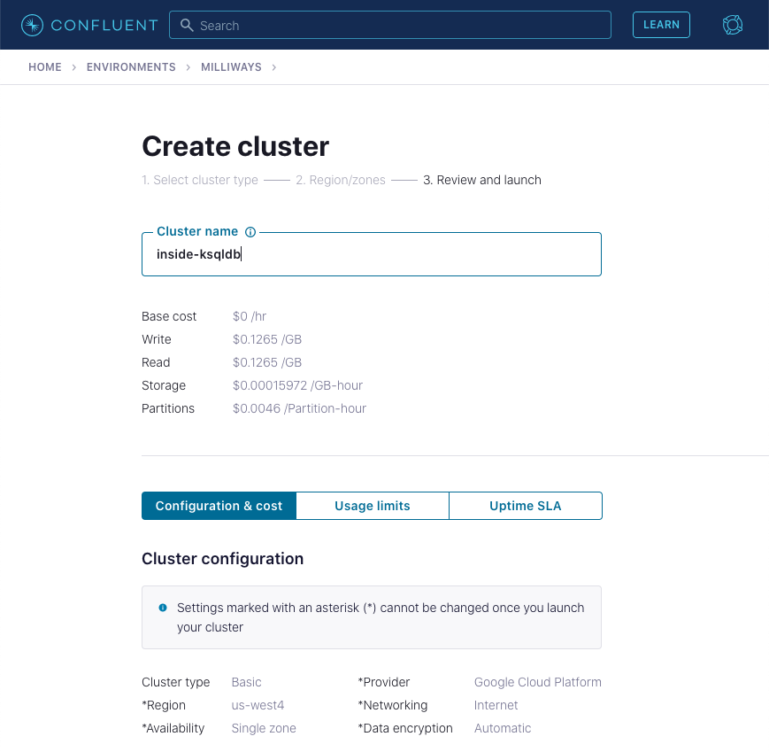

3. Now go to the ksqlDB page within your Confluent Cloud cluster and click `Add application`. 
+
If prompted, select *Create application myself*. 
+
Leave the _access control_ set to *Global access*. Give _application name_ as `inside-ksqldb`, and leave the _number of streaming units_ set to *4*. 
+
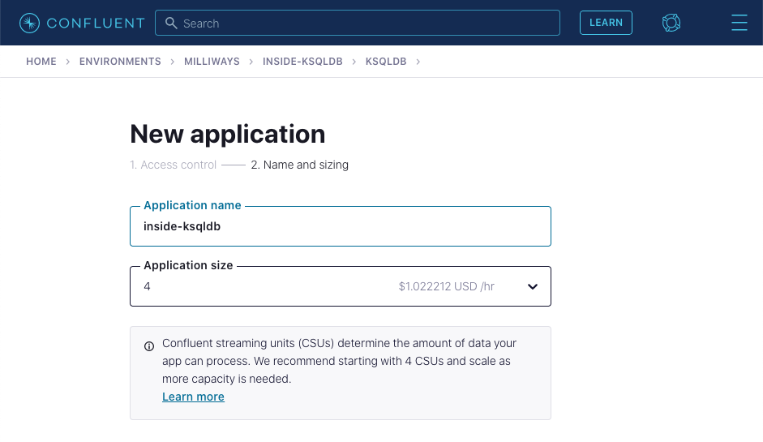
+
The ksqlDB application will take a few minutes to provision. 
====

Navigate to the ksqlDB application

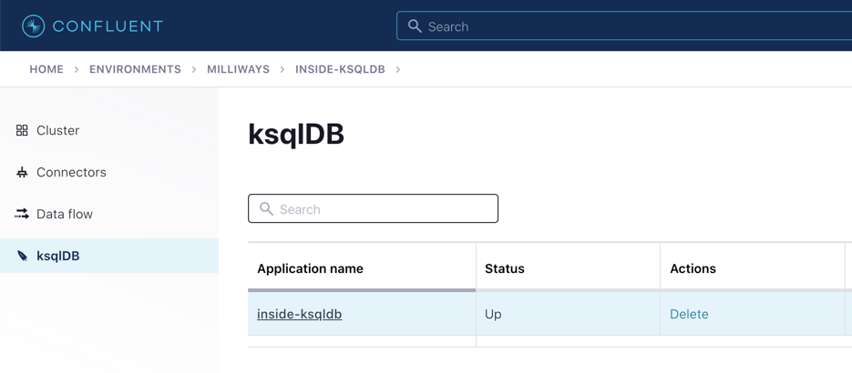

### Create the source objects

Run the following two ksqlDB statements in the ksqlDB editor and confirm that both complete successfully. 

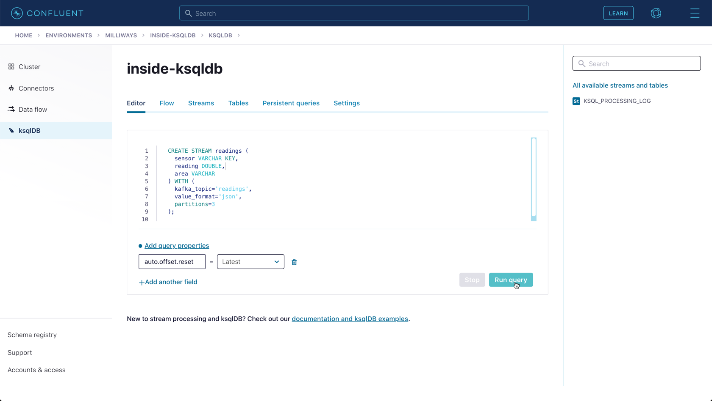

1. A stream of events holding data about reading received from a sensor
+
[source,sql]
----
CREATE STREAM readings (
  sensor VARCHAR KEY,
  reading DOUBLE,
  area VARCHAR
) WITH (
  kafka_topic='readings',
  value_format='json',
  partitions=3
);
----

2. A table holding information about the brand name of different sensors
+
[source,sql]
----
CREATE TABLE brands (
  sensor VARCHAR PRIMARY KEY,
  brand_name VARCHAR
) WITH (
  kafka_topic='brands',
  value_format='json',
  partitions=3
);
----

On the right hand side of the ksqlDB editor you should see the new stream and table listed

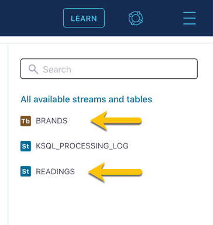

### Populate the table

A table in ksqlDB is often populated using data streamed into a Kafka topic from another application or Kafka Connect. Tables can also be populated directly, using the `INSERT INTO` statement, which is what we'll do here. Run the following statements in ksqlDB. You can run them individually or as multiple statements together. 

[source,sql]
----
INSERT INTO brands (sensor, brand_name) VALUES ('sensor-1','Cassin Inc');
INSERT INTO brands (sensor, brand_name) VALUES ('sensor-2','Carroll Ltd');
INSERT INTO brands (sensor, brand_name) VALUES ('sensor-3','Hirthe Inc');
INSERT INTO brands (sensor, brand_name) VALUES ('sensor-4','Walker LLC');
----

You can check that the data has been written to the table by querying it. Make sure you have set `auto.offset.reset` to `earliest` using the drop down menu: 

[source,sql]
----
SELECT * 
  FROM brands 
  EMIT CHANGES;
----

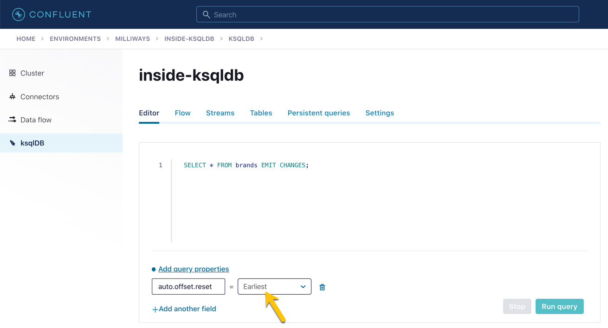

Note that it can take around thirty seconds for the data to be returned to the screen. When it is, you can switch between how it is rendered using the icons to the top right of the data

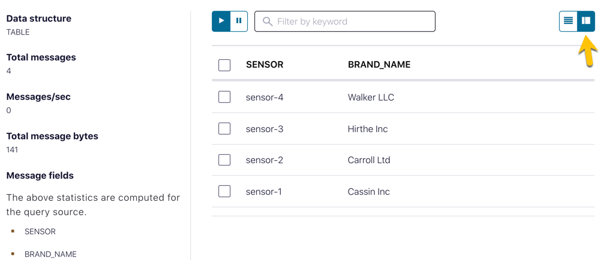

### Populate the stream

Insert some events into the `readings` stream by running the following: 

[source,sql]
----
INSERT INTO readings (sensor, reading, area) VALUES ('sensor-1',45,'wheel');
INSERT INTO readings (sensor, reading, area) VALUES ('sensor-2',41,'motor');
INSERT INTO readings (sensor, reading, area) VALUES ('sensor-1',92,'wheel');
INSERT INTO readings (sensor, reading, area) VALUES ('sensor-2',13,'engine');
----

### Run the stream-table join query

Now you can run the stream-table join and see it in action. 

Tell ksqlDB to processes all messages from the beginning of the stream by setting `auto.offset.reset` to `earliest` in the drop down menu: 

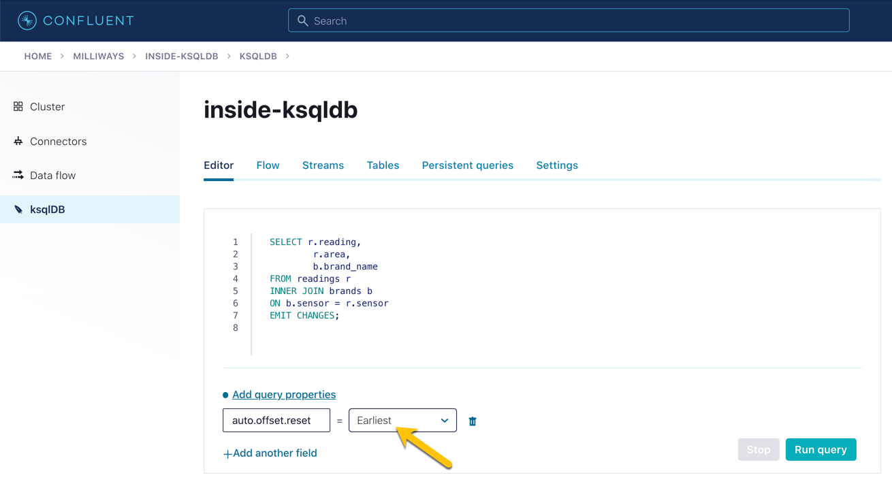

[source,sql]
----
SELECT r.reading,
        r.area,
        b.brand_name
FROM readings r
INNER JOIN brands b
ON b.sensor = r.sensor
EMIT CHANGES;
----

Click on *Run query*. This executes the stream-table join, and you should shortly see the results of the join. Observe that for each reading the brand name of the sensor from which the reading was taken is included in the output, having been determined by a join to the `brands` table on the common `sensor` column.

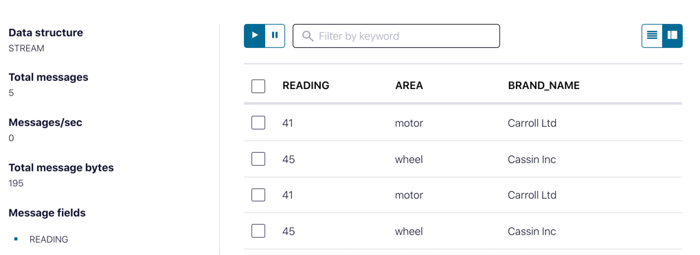

Leave the query running and open a second browser window. In this new window go to the ksqlDB editor and insert some new rows into the the `readings` stream.

[source,sql]
----
INSERT INTO readings (sensor, reading, area) VALUES ('sensor-2',90,'engine');
INSERT INTO readings (sensor, reading, area) VALUES ('sensor-4',95,'motor');
INSERT INTO readings (sensor, reading, area) VALUES ('sensor-3',67,'engine');
----

After a moment you should see the result of the stream-table join appear in the window in which you ran the `SELECT` statement:

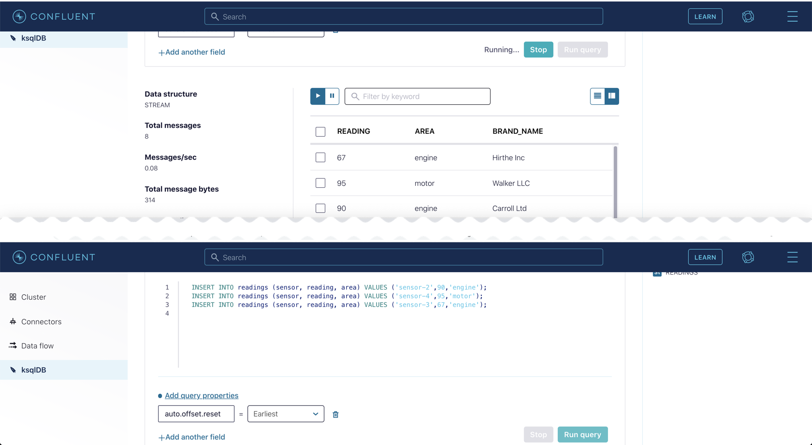

### Persist the enriched events to a new stream

In the query above the results of the join were output to the screen. ksqlDB can populate new streams with the results from a continuous query (such as the one we saw above). Let's do that here. 

As before, make sure you have set `auto.offset.reset` to `earliest` in the drop down menu, and then run this query

[source,sql]
----
CREATE STREAM enriched_readings AS
  SELECT r.reading,
         r.area,
         b.brand_name
  FROM readings r
  INNER JOIN brands b
  ON b.sensor = r.sensor
  PARTITION BY r.area
  EMIT CHANGES;
----

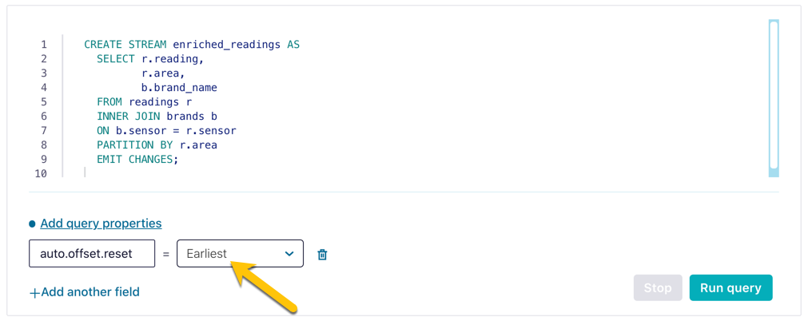

With the stream created, you can query it: 

[source,sql]
----
SELECT * 
  FROM enriched_readings 
  EMIT CHANGES;
----

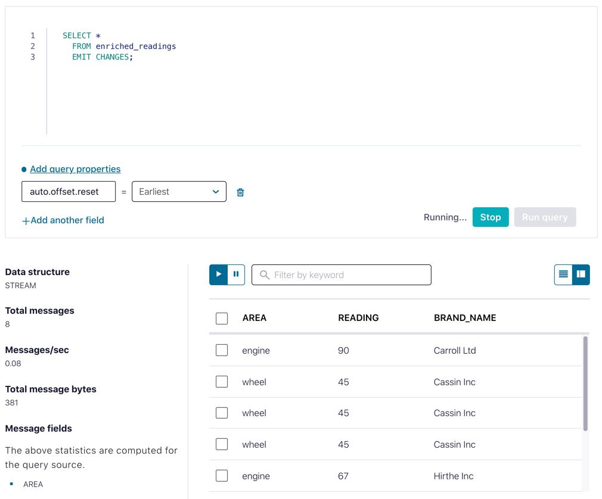

With another editor window insert some more events into the `readings` stream and observe how the events are written to `enriched_readings` with the brand details added. 

If you have access to the Data Lineage view on Confluent you can see a visual representation of what you've built: 

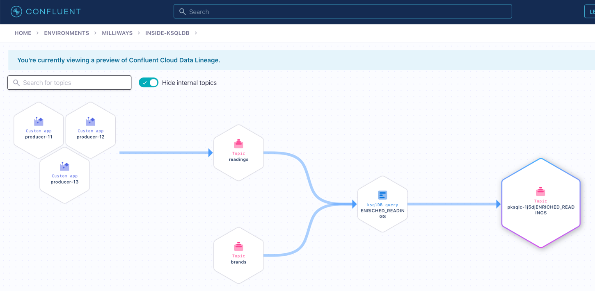
